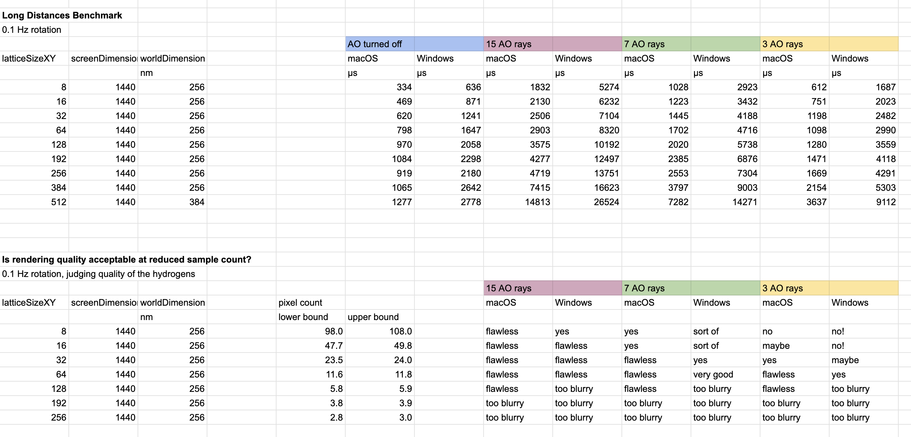

# Tests: High Atom Count

## Rotating Beam

Objective is to reach as many atoms as possible, until the Metal Performance HUD shows the FPS dropping below the display's native refresh rate. Windows users can detect the drop by observing stuttering in the animation. When you are just at the limit of atom count, it may take a few seconds for the FPS to stabilize at the target value.

|                        | macOS  | Windows            |
| ---------------------- | :----: | :----------------: |
| FPS target             | 120    | 60                 |
| CPU model              | M1 Max | Intel Core i5-4460 |
| CPU cores used in test | 1      | 1                  |

| Maximum Atom Count | macOS     | Windows   |
| ------------------ | --------: | --------: |
| Theoretical        | 1,546,000 | 954,000   |
| Actual             | 933,742   | 820,503   |

In the source code, look for the declaration of `beamDepth`. The default value is 16. Increase this number as much as possible.

Guide to figuring out what beam depths to try

| Beam Depth | Atom Count |
| :--------: | ---------: |
| 1   | 27,830    |
| 2   | 44,007    |
| 3   | 60,184    |
| 4   | 76,361    |
| 6   | 108,715   |
| 8   | 141,069   |
| 12  | 204,777   |
| 16  | 270,485   |
| 24  | 399,901   |
| 32  | 529,317   |
| 40  | 658,733   |
| 48  | 788,149   |
| 56  | 917,565   |
| 64  | 1,046,981 |
| 80  | 1,305,813 |
| 96  | 1,564,645 |
| 112 | 1,823,477 |

For high-end GPUs, this test should be bottlenecked by the system's CPU. There is room to improve by multithreading the Swift code for animating the beam and writing to `application.atoms`. For detailed explanation of the performance limits, see the comments in "Sources/MolecularRenderer/Atoms.swift".

## Long Distances

Test that hits the pain points of ray tracing. Long primary ray traversal times in the DDA, high divergence for AO rays. Not exactly stressing the BVH update process. Rather, a single unchanging BVH and a rotating camera to detect stuttering. Scaleable to different distances and window sizes.

The structure is a hydrogen-passivated, Si(100)-(2×1) lattice generated with [`reconstruction.compile()`](https://github.com/philipturner/HDL/blob/main/Documentation/API/Reconstruction.md). The largest setting has 5.6 million atoms, takes over 10 seconds to compile, and causes issues with the GTX 970 running out of memory.

## Large Scenes

Objective is to reach as many atoms as possible, until your GPU runs out of memory.

A large number of 100k atom cubes, each with a random orientation. All packed in a grid, with a spacing to ensure they don't overlap. This hits the pain points of partial filling that waste memory, therefore being a realistic example of achievable atom count.

| Chip            | RAM    | Theoretical Max Atoms | Actual Max Atoms |
| --------------- | -----: | --------------------: | ---------------: |
| GTX 970         | 3.5 GB | 33M   |     |
| M1 @ 60 Hz      |   8 GB | 75M   | n/a |
| M1 Pro @ 120 Hz |  16 GB | 150M  | n/a |
| 7900 XTX        |  24 GB | 225M  | n/a |
| RTX 4090        |  24 GB | 225M  | n/a |
| M1 Max          |  32 GB | 300M  |     |
| RTX 5090        |  32 GB | 300M  | n/a |
| M3 Max          | 128 GB | 1200M | n/a |
| M3 Ultra        | 512 GB | 4800M | n/a |

Another limiter to atom count might be moiré patterns. CAD workflows at the million atom scale should strive to maximize window size and minimize camera distance. By packing the nanoparts less closely, this test follows a bad practice and increases the camera distance. Therefore, we provide an option to pack the nanoparts densely and see how this affects both performance and quality.

| Maximum Atom Count           | macOS       | Windows    |
| ---------------------------- | ----------: | ---------: |
| Theoretical                  | 300,000,000 | 33,000,000 |
| Actual (Dense Packing)       |             | 18,818,624 |
| Actual (Inefficient Packing) |             | 14,007,004 |

When the Windows machine reaches the limit of atom count, the BVH update process is sometimes noticeably slower. Probably the ~50 ms, $O(1)$ latency for paging data. There is a small amount of wiggle room (~10% difference) where out-of-memory issues may plague the BVH update process, but not the render process. I took data until rendering showed signs of breaking down.

TODO: Create and link a YouTube video in a future commit.
