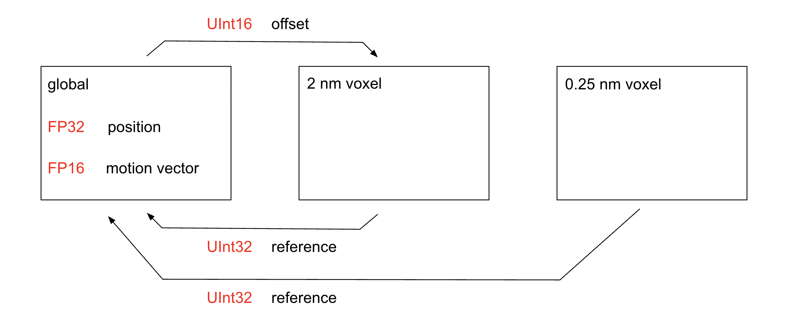

# BVH Update Process

This is an effort to organize the numerous sub-tasks of the acceleration structure PR, and provide a high-level understanding for those seeking to debug/modify the finished code.

> Defer all non-critical components (optimizations) until after we have a functioning ray intersector again. Then, halt progress on the ray intersector until the BVH is completely finished.
>
> Remember that you can always deactivate upscaling to avoid coupling from invalid motion vectors.

## Acceleration Structure Layout

Simplest implementation:

16-bit data types optimization:

Revision: the 16-bit offset is temporary and can be ignored after integrating the atom into the BVH. It will be inaccurate in future frames, as the 2 nm voxel's reference list rearranges to fill empty slots.

## Idle/Active Paradigm

Certain allocations ought to be sanitized or reset back to 0, prior to the next frame. When these allocations are very large, scanning the entire buffer would incur an unreasonable bandwidth cost. Instead, one must keep track of which subregions of the buffer were modified. Then, revert the changes as soon as possible.

Affected allocations:
- motion vectors
- 8x duplicated atomic counters for every 2 nm voxel

Motion vectors are held in the active state by referring to the transaction sent to the GPU during the current frame. After the image is rendered, the motion vectors return to the idle state. Finally, the transaction is forgotten.

Bandwidth-intensive atomic counters are optimized by tagging 8 nm "voxel groups". Only if a voxel group is tagged, will future kernels inspect its 2 nm voxels for modifications. Kernels scoped at the 2 nm level still dispatch one thread per 2 nm voxel in the world volume. However, they use 4x4x4 threadgroups and thus are naturally scoped at 8 nm. The kernels return early when they don't need to perform bandwidth-intensive operations.

## Stages

Remove Process
- tag removed atoms as distinct from others in the address space
- tag impacted 2 nm voxels
- within each 2 nm voxel, search the reference list for atoms to remove
- prefix sum to compact the reference list
- free the memory slots for fully empty voxels

Add Process
- in three GPU kernels, atomically accumulate number of atoms added to each static 2 nm voxel
  - accumulate into one of 8 counters per voxel to reduce memory conflicts, store the atom's assigned offset to RAM
  - sum the 8 counters in each voxel, assign memory slots for completely new voxels
  - write new atom references into end of list in 2 nm voxel
- A small fraction of atoms overlap more than one 2 nm voxel. Although this percentage is low, the chance of 1 thread of a SIMD of 32 having it is much greater. To minimize costs stemming from divergence, the iteration over a 2x2x2 grid of possible overlapping voxels is reordered.

Rebuild Process
- all 2 nm voxels tagged during the previous 2 processes are rebuilt from scratch
  - assumed impossible to recycle any data built at the 0.25 nm level
- all stages fused into a single GPU kernel
  - Register each instance where an atom overlaps a 0.25 nm voxel. Tradeoff between memory efficiency and compute cost determines whether to use cube-sphere intersection test.
  - Perform reductions over the 512 small voxels in the larger voxel, exploiting a conveniently sized threadgroup memory allocation.
  - Generate lists of true number of atoms that intersect a 0.25 nm voxel. Write 16-bit or 32-bit atom references to RAM, incurring the majority of this kernel's bandwidth cost.
  - Read the true size of the per 0.25 nm voxel list from threadgroup memory, store to RAM as bookkeeping data for BVH traversal.
  
## Memory Allocation

Currently using a simple design where every _occupied_ 2 nm voxel gets a fixed chunk of memory to store its data. This wastes a lot of memory. Future implementations could allocate smaller chunks for certain voxels.

Every frame, garbage collect or scan the entire array of memory slots. Create a compacted list of available ones. Do this right after the "remove process", so the "add process" can read from the list.

If all slots in the list of available ones are used up, the GPU writes to a crash flag. Every single GPU kernel in the entire Molecular Renderer library must read this crash flag. If set to an error value, the kernel returns early or produces a sensible default output.
