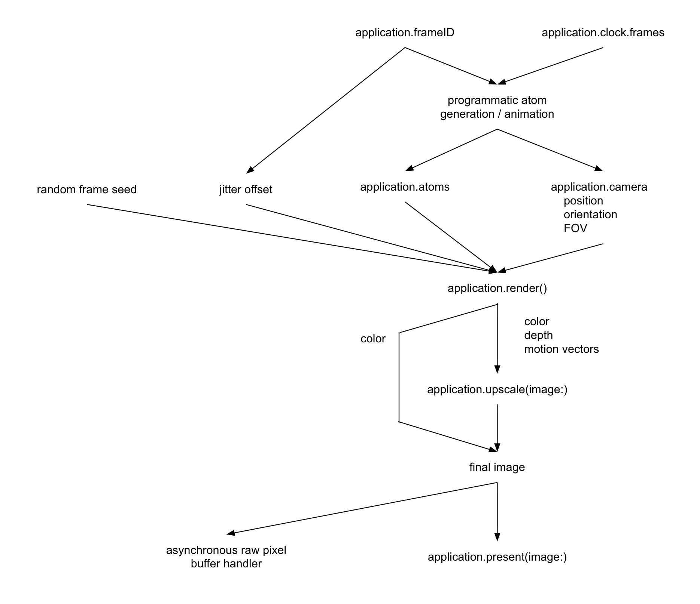
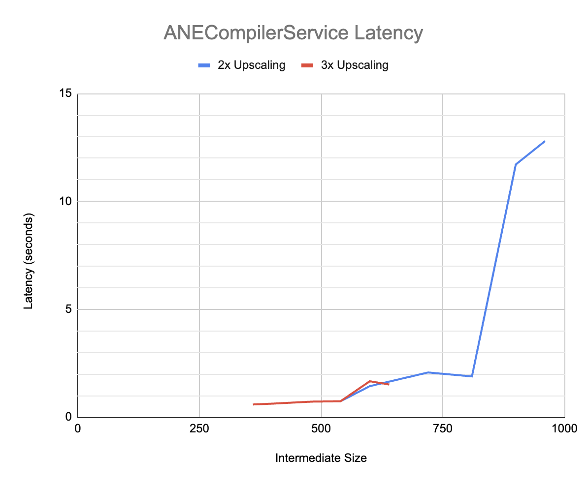
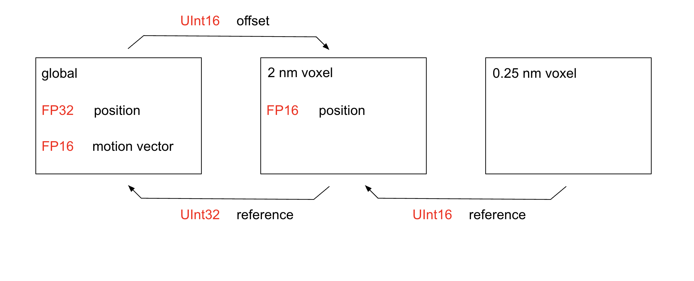

# Other Documentation

## Render Process Diagram



### Asynchronous Raw Pixel Buffer Handler

> This API is required before users can make professional YouTube videos out of animations. Until then, record your computer screen with a smartphone camera.

API design requirements:
- Handlers should be executed on a sequential dispatch queue. Although it's
  not thread safe with the main or `@MainActor` thread, it's thread safe
  between sequential calls to itself.
- Implement an equivalent of 3 frames in flight `DispatchSemaphore` for the
  asynchronous handlers, to avoid overflowing the dispatch queue for this.
  - The user should be able to stall the render loop, for example to encode a large batch of GIF frames. They do this by making the handler take extra long, thus reaching the limit of the dispatch semaphore.
- Guarantee that all asynchronous handlers have executed before
  `application.run()` returns.

Perhaps it would be more appropriate to exit the `application.run()` paradigm entirely for offline rendering. `Display` and `Clock` are inappropriate because there is no interaction with DXGI/CVDisplayLink, notion of "frames per second", or need to accurately track wall time for real-time animations. However, the backend code can be applied to offline rendering with little effort. It is mostly a frontend (API) design problem.

Solution: add a second mode for `Display`. In the descriptor, leave `monitorID` as `nil` and instead specify the pixel buffer handler in `handler`. The application now follows the same APIs as a real-time render loop. It creates an artificial "display" with triple buffering, but no actual link to DXGI. The frame rate is zero and the clock never increments. Every call to `application.present()` forwards an asynchronous handler to the dispatch queue mentioned above.

> In real-time renders, always use `clock.frames` to find the accurate time for coding animations. In offline renders, always use `frameID` for correct timing.

A new API function, `application.stop()`, prevents the next run loop from happening. Functions called during the current loop iteration (before `stop()` is called) still work the same. `application.present()` forwards one final render command to the GPU, which will be handled in the `handler` before the backend fully shuts down. Finally, `application.run()` exits the scope of its closure and the calling program resumes. The user can perform custom cleanup processes without relying on intentional program crashes (`exit(0)` and `fatalError`).

## Rendering Performance

The time to render a frame is a multiplication of many variables. Like the Drake Equation, changing a few by 2x could change the end result by 10x. Users can tune these variables to render as many pixels as possible, while still producing one frame per display refresh period.

| Multiplicative Factor | Explanation |
| --------------------- | ----------- |
| GPU model             | More powerful GPUs render a scene faster |
| FPS target            | Lower refresh-rate displays permit more render time (in ms/frame) |
| Window resolution     | Less pixels means less compute cost |
| Upscale factor        | Make this as high as possible without graphical quality issues |
| Atom count            | $O(1)$ with an acceleration structure, otherwise $O(n)$ |
| AO sample count       | Number of rays cast/pixel = (1 + AO sample count). Primary ray will be more expensive than AO rays because it must travel extremely large distances through the uniform grid. |
| Coverage of FOV       | Images with mostly empty space will not incur the cost of AO rays. This makes it look like the renderer supports more expensive settings than it actually does, in general applications. |

GPU time spent updating the acceleration structure will eat into time available for rendering. The cost of this scales linearly with atom count (atoms that are moving, not atom count of the entire scene). The above performance model assumes a static scene, where the cost of updating the acceleration structure is zero.

These combinations of settings are known to run smoothly (or predicted to).

| Multiplicative Factor | macOS     | macOS (target audience) | Windows |
| --------------------- | :-------: | :-------: | :-------: |
| GPU model             | M1 Max    | M1        | GTX 970   |
| FPS target            | 120 Hz    | 60 Hz     | 60 Hz     |
| Window resolution     | TBD       | TBD       | TBD       |
| Upscale factor        | 1x        | 1x        | 1x        |
| AO sample count       | 15        | 15        | 15        |

| Multiplicative Factor | macOS     | macOS (target audience) | Windows |
| --------------------- | :-------: | :-------: | :-------: |
| GPU model             | M1 Max    | M1        | GTX 970   |
| FPS target            | 120 Hz    | 60 Hz     | 60 Hz     |
| Window resolution     | TBD       | TBD       | TBD       |
| Upscale factor        | 2x        | 2x        | 2x        |
| AO sample count       | 15        | 15        | 15        |

| Multiplicative Factor | macOS     | macOS (target audience) | Windows |
| --------------------- | :-------: | :-------: | :-------: |
| GPU model             | M1 Max    | M1        | GTX 970   |
| FPS target            | 120 Hz    | 60 Hz     | 60 Hz     |
| Window resolution     | TBD       | TBD       | TBD       |
| Upscale factor        | 3x        | 3x        | 3x        |
| AO sample count       | 15        | 15        | 15        |

The benchmarked systems are a few atoms very close to the user, consuming all of the FOV. Divergence is negligible and the critical distance heuristic does not kick in. The test does not face the cost of primary rays traveling large distances; AO cost dominates.

TODO: Test performance after getting the acceleration structure working.

## Ambient Occlusion Sample Count

The most computationally intensive part of rendering is estimating the degree of self-shadowing, or how "occluded" / crowded a location is. A place wedged between two atoms should appear darker than an unobstructed surface exposed directly to open space. In practice, this is achieved by randomly choosing a set of ray directions, then following the rays until they hit a nearby surface.

A default of 7 or 15 secondary rays results in sufficient quality for any general use case. However, in cases prone to high divergence (non-uniform control flow, disorder or random memory access patterns), GPU performance may degrade so much that the FPS target cannot be reached. Divergence happens more often in regions far away from the camera. At large distances, each atom appears smaller, which (long story short) means higher divergence.

### Critical Pixel Count Heuristic

A simple heuristic reduces the number of secondary rays, at a certain distance from the user. When atoms are small, they are harder to clearly see, and therefore can afford less rendering quality. The reduction in sample count cancels the increase in divergence, leading to consistent rendering speed in all use cases.

TODO: Implement and document the heuristic.
- No need for a complex Google Sheet to model multiple coupled variables, combined with subjectiveness of specific data points harming sensible quantitative analysis.

Realization: test this by rendering an `.elemental` material, seeing how a single atom looks when it gets very small. Go by the need for AO quality in the intermediate texture, prior to upscaling. Therefore, 3x upscale factor tends to _reduce_ the AO sample count with the critical distance heuristic. 1x upscale is rendered at many more pixels, thus AO sample count is higher. We can use data gathered at 1x upscale, and it will generalize to 3x upscale without quality degradation. Problem solved! Go by quality in the final texture.

Project the atom's radius onto the screen. Figure out how many pixels it spans after upscaling. Use that calculated pixel count as input for the heuristic. Different elements will have different pixel counts because their atoms are larger.

We can now specify a better API:

```swift
struct Camera {
  /// The number of AO rays for ambient occlusion. Must be at least 3.
  ///
  /// Defaults to 15. Change to `nil` to disable ambient occlusion.
  ///
  /// In the future, the default may vary based on the refresh rate for the
  /// display, when in real-time rendering mode. It is not likely, but we must
  /// anticipate the possibility.
  var secondaryRayCount: Int?
  
  /// The number of pixels an atom spans on-screen, before the secondary ray
  /// count starts dropping off with the reciprocal of distance. The secondary
  /// ray count will never drop below 3.
  ///
  /// Defaults to TBD. Change to `nil` to disable the critical pixel count
  /// heuristic.
  var criticalPixelCount: Float?
}
```

In the backend, encode these settings in `RenderArgs` instead of `CameraArgs`.

## MetalFX Latency Issues

On macOS, there is a problem with the MetalFX framework that may lead to massive program startup times. These appear as if Swift switched from `-Xswiftc -Ounchecked` to true release mode, making the user wait up to 10 seconds to compile after the tiniest change to the code.

The source of this problem was narrowed down to ANECompilerService, which is invoked when creating `MTLFXTemporalUpscaler` for the first time after the Swift program has been recompiled with changes. The first-time latency is dictated by the graph below, where the intermediate size is the texture size prior to upscaling. The second-time latency is 0.2&ndash;0.3 seconds.



In a typical use case, the upscaled size is 1920x1920 and the intermediate size is 640x640. The user faces a 2-second delay on every program startup, which would typically be hard to notice. The upscale factor is then switched from 3x to 2x, making the intermediate size 960x960. The delay skyrockets to 10 seconds. This is the exact scenario that led to discovery of the problem. It may have been around since 2023, as the earliest upscaling went from 640x640 -> 1280x1280.

## FidelityFX Quality Issues

Molecular Renderer was originally developed with MetalFX, an ML-based upscaler. AMD FSR 3 (the version portable to a wide variety of GPU models) is not ML-based. The first major difference is ghosting when atoms suddenly disappear/appear in the scene. For an animation switching between isopropanol and silane, the ghosting is worst when the molecules aren't moving, and they alternate every 1 second. Waiting 3&ndash;10 seconds before switching, or including a 0.5 Hz rotation animation, makes the ghosting hard to notice.

The next major difference is the need for higher AO sample count. This may be coupled with the fact that the macOS setup runs at 120 Hz, while the Windows setup runs at 60 Hz. With no upscaling, the higher refresh rate created more temporal averaging from perception of the human viewer. 120 Hz @ 7 AO samples could "average" as well as 60 Hz @ 15 AO samples. The shaders should be exactly the same on both platforms; this is the best explanation for the quality drop on 60 Hz @ 7 AO samples.

With upscaling turned on, FidelityFX struggled to accurately denoise the AO. It was very pixelated or grainy when atoms moved fast. Switching from 7 to 15 samples massively improved this graininess. While graininess is still present, the degree of severity is now tolerable. 15 samples are needed, regardless of whether the upscale factor is 2x or 3x.

> The default AO sample count has risen to 15 on all platforms, for fairness/equality between platforms. For members of the macOS target audience (base M1 chip), you probably want to reduce this to 7. AO sample count is specified in `RenderShader.swift`.

There are a few other, minor artifacts. Along the border between a silicon and hydrogen atom, white pixels can appear sporadically on the silicon side. Also, when atoms move quickly (isopropanol rotating at 0.5 Hz), the border between atoms can be a bit jumpy. In the MM4 carbosilane test, FSR shows noticeable artifacts at the borders between slowly moving atoms, while MetalFX does not.

Despite its downsides, FSR 3 makes it possible to bring Molecular Renderer to the Windows target audience (GTX 970 and later, RDNA 1 and later). Older hardware works precisely because FSR 3 does not rely on computationally intensive neural networks, and it does not require hardware FP16 arithmetic.

## 16-Bit Data Types Optimization



It is possible to reduce the memory costs of the acceleration structure, by taking advantage of the small number of atoms per 2 nm voxel (less than 2<sup>16</sup>) and compressing atom positions to FP16. This optimization slightly speeds up the BVH update process and ray-sphere intersection tests.

The current code partially implements this optimization. It uses two levels of indirection to fetch the atom position, which is just the FP32 source of truth. There are now 3 memory operations per ray-sphere test, instead of 2. However, the BVH memory footprint is now smaller than any alternative design.

Improvement: 96264 bytes/voxel → 55304 bytes/voxel

Alternative design: 79880 bytes/voxel
