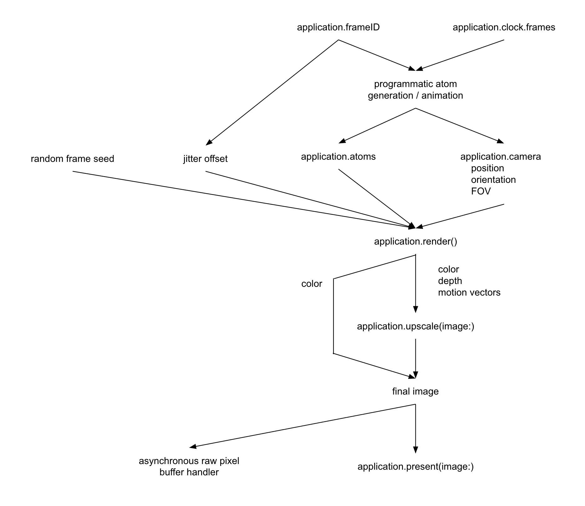

# Render Process

Revision: offline rendering uses synchronous code instead of asynchronous handlers. There is no triple-buffering in the backend, because speed is not the primary design goal for offline renders.

## Rendering Performance

The time to render a frame is a multiplication of many variables. Like the Drake Equation, changing a few by 2x could change the end result by 10x. Users can tune these variables to render as many pixels as possible, while still producing one frame per display refresh period.

| Multiplicative Factor | Explanation |
| --------------------- | ----------- |
| GPU model         | More powerful GPUs render a scene faster |
| FPS target        | Lower refresh-rate displays permit more render time (in ms/frame) |
| Window resolution | Less pixels means less compute cost |
| Upscale factor    | Make this as high as possible without graphical quality issues |
| AO sample count   | Number of rays/pixel = 1 + AO sample count. Primary ray is ~5 times more expensive than each AO ray. |
| Distance          | Cost of all rays scales linearly with distance up to ~75 nm away. Afterward, cost of AO rays skyrockets from worsening divergence. Theoretical limit is 32x worse than value at short distances. |
| Coverage of FOV   | Images with mostly empty space will not incur the cost of AO rays. This makes it look like the renderer supports more expensive settings than it actually does, in general applications. |

GPU time spent updating the acceleration structure will eat into time available for rendering. The cost of this scales linearly with atom count (atoms that are moving, not atom count of the entire scene). The above performance model assumes a static scene, where the cost of updating the acceleration structure is zero.

These combinations of settings are known to run smoothly (or predicted to, for M1). The long distances test is used, with `latticeSizeXY` set to 16, 64, or 256. The critical pixel count heuristic is disabled.

| Multiplicative Factor | macOS     | macOS (target audience) | Windows |
| --------------------- | :-------: | :-------: | :-------: |
| GPU model             | M1 Max    | M1        | GTX 970   |
| FPS target            | 120 Hz    | 60 Hz     | 60 Hz     |

### Short Distance (2.8 nm @ 90° FOV)

| Multiplicative Factor | macOS     | macOS (target audience) | Windows |
| --------------------- | :-------: | :-------: | :-------: |
| Window resolution     | 1800x1800 | 1272x1272 | 1410x1410 |
| Upscale factor        | 2x        | 2x        | 2x        |
| AO sample count       | 15        | 15        | 15        |

| Multiplicative Factor | macOS     | macOS (target audience) | Windows |
| --------------------- | :-------: | :-------: | :-------: |
| Window resolution     | 2100x2100 | 1482x1482 | 2010x2010 |
| Upscale factor        | 3x        | 3x        | 3x        |
| AO sample count       | 15        | 15        | 15        |

### Medium Distance (11.5 nm @ 90° FOV)

| Multiplicative Factor | macOS     | macOS (target audience) | Windows |
| --------------------- | :-------: | :-------: | :-------: |
| Window resolution     | 2100x2100 | 1482x1482 | 1680x1680 |
| Upscale factor        | 2x        | 2x        | 2x        |
| AO sample count       | 7         | 7         | 7         |

| Multiplicative Factor | macOS     | macOS (target audience) | Windows |
| --------------------- | :-------: | :-------: | :-------: |
| Window resolution     | 2100x2100 | 1482x1482 | 2100x2100 |
| Upscale factor        | 3x        | 3x        | 3x        |
| AO sample count       | 7         | 7         | 7         |

### Long Distance (46.2 nm @ 90° FOV)

| Multiplicative Factor | macOS     | macOS (target audience) | Windows |
| --------------------- | :-------: | :-------: | :-------: |
| Window resolution     | 1920x1920 | 1356x1356 | 1710x1710 |
| Upscale factor        | 2x        | 2x        | 2x        |
| AO sample count       | 3         | 3         | 3         |

| Multiplicative Factor | macOS     | macOS (target audience) | Windows |
| --------------------- | :-------: | :-------: | :-------: |
| Window resolution     | 2100x2100 | 1482x1482 | 2100x2100 |
| Upscale factor        | 3x        | 3x        | 3x        |
| AO sample count       | 3         | 3         | 3         |

## Ambient Occlusion Sample Count

The most computationally intensive part of rendering is estimating the degree of self-shadowing, or how "occluded" / crowded a location is. A place wedged between two atoms should appear darker than an unobstructed surface exposed directly to open space. In practice, this is achieved by randomly choosing a set of ray directions, then following the rays until they hit a nearby surface.

A default of 7 or 15 secondary rays results in sufficient quality for any general use case. However, in cases prone to high divergence (non-uniform control flow, disorder or random memory access patterns), GPU performance may degrade so much that the FPS target cannot be reached. Divergence happens more often in regions far away from the camera. At large distances, each atom appears smaller, which (long story short) means higher divergence.

### Critical Pixel Count Heuristic

A simple heuristic reduces the number of secondary rays, at a certain distance from the user. When atoms are small, they are harder to clearly see, and therefore can afford less rendering quality. The reduction in sample count cancels the increase in divergence, leading to consistent rendering speed in all use cases.

| element | radius    | pixels @ 7 samples | pixels @ 3 samples |
| :-----: | --------: | --: | --: |
| H       | 0.0930 nm |  28 |  12 |
| C       | 0.1426 nm |  43 |  18 |
| Si      | 0.1744 nm |  52 |  22 |
| Au      | 0.2371 nm |  71 |  30 |

_Critical pixel count with the old code base._

| element | radius    | pixels @ 15 samples | pixels @ 7 samples | pixels @ 3 samples |
| :-----: | --------: | --: | --: | --: |
| H       | 0.0930 nm |  50 |  23 |  10 |
| C       | 0.1426 nm |  50 |  23 |  10 |
| Si      | 0.1744 nm |  50 |  23 |  10 |
| Au      | 0.2371 nm |  50 |  23 |  10 |

_Critical pixel count with the new code base._

## Distance Scaling Behavior

The inflection point for AO cost is ~75 nm. This value is attained at 1440 px, 90° FOV, and a hydrogen-passivated, Si(100)-(2×1) surface. The exact point could change with a different setup.

At the inflection point, hydrogen atoms span ~2 pixels on screen (2 after upscaling, 0.67 before). Severe moiré patterns make visualization challenging. The patterns are probably unavoidable because ray traced rendering does not rely on traditional rasterization techniques. Rasterized renderers often use MSAA or mipmapping to fix aliasing problems.

## MetalFX Latency Issues

On macOS, there is a problem with the MetalFX framework that may lead to massive program startup times. These appear as if Swift switched from `-Xswiftc -Ounchecked` to true release mode, making the user wait up to 10 seconds to compile after the tiniest change to the code.

The source of this problem was narrowed down to ANECompilerService, which is invoked when creating `MTLFXTemporalUpscaler` for the first time after the Swift program has been recompiled with changes. The first-time latency is dictated by the graph below, where the intermediate size is the texture size prior to upscaling. The second-time latency is 0.2&ndash;0.3 seconds.

In a typical use case, the upscaled size is 1920x1920 and the intermediate size is 640x640. The user faces a 2-second delay on every program startup, which would typically be hard to notice. The upscale factor is then switched from 3x to 2x, making the intermediate size 960x960. The delay skyrockets to 10 seconds. This is the exact scenario that led to discovery of the problem. It may have been around since 2023, as the earliest upscaling went from 640x640 -> 1280x1280.

## FidelityFX Quality Issues

Molecular Renderer was originally developed with MetalFX, an ML-based upscaler. AMD FSR 3 (the version portable to a wide variety of GPU models) is not ML-based. The first major difference is ghosting when atoms suddenly disappear/appear in the scene. For an animation switching between isopropanol and silane, the ghosting is worst when the molecules aren't moving, and they alternate every 1 second. Waiting 3&ndash;10 seconds before switching, or including a 0.5 Hz rotation animation, makes the ghosting hard to notice.

The next major difference is the need for higher AO sample count. This may be coupled with the fact that the macOS setup runs at 120 Hz, while the Windows setup runs at 60 Hz. With no upscaling, the higher refresh rate created more temporal averaging from perception of the human viewer. 120 Hz @ 7 AO samples could "average" as well as 60 Hz @ 15 AO samples. The shaders should be exactly the same on both platforms; this is the best explanation for the quality drop on 60 Hz @ 7 AO samples.

With upscaling turned on, FidelityFX struggled to accurately denoise the AO. It was very pixelated or grainy when atoms moved fast. Switching from 7 to 15 samples massively improved this graininess. While graininess is still present, the degree of severity is now tolerable. 15 samples are needed, regardless of whether the upscale factor is 2x or 3x.

> The default AO sample count has risen to 15 on all platforms, for fairness/equality between platforms. For members of the macOS target audience (base M1 chip), you probably want to reduce this to 7. AO sample count is specified in `RenderShader.swift`.

There are a few other, minor artifacts. Along the border between a silicon and hydrogen atom, white pixels can appear sporadically on the silicon side. Also, when atoms move quickly (isopropanol rotating at 0.5 Hz), the border between atoms can be a bit jumpy. In the MM4 carbosilane test, FSR shows noticeable artifacts at the borders between slowly moving atoms, while MetalFX does not.

Despite its downsides, FSR 3 makes it possible to bring Molecular Renderer to the Windows target audience. Older GPUs work precisely because FSR 3 does not rely on computationally intensive neural networks, and it does not require hardware FP16 arithmetic.
