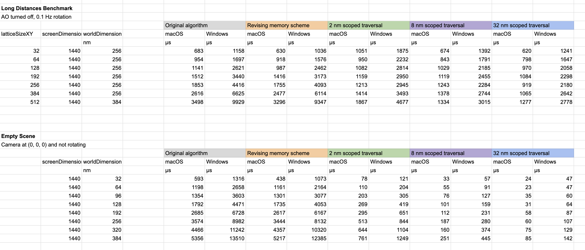

# Tests

To run each test, copy the source code from the relevant file in [Tests](./Tests). Paste the code into "Sources/Workspace/main.swift", overwriting the Hello World template. Then follow the program startup instructions for your operating system.

## Upscaling

Animation where both the molecule and camera are rotating. Alternates between isopropanol and silane every 3 seconds. Checks that the upscaler can correctly keep track of motion vectors, while upscaling the resolution by 3x.

Reference video for users to compare their upscaling quality: [YouTube](https://www.youtube.com/shorts/4LudSkOQRgs)

## OpenMM Plugin Test

Import the OpenMM module and validate that the OpenCL plugin can be loaded.

Should report that two platforms exist: Reference, OpenCL

Molecular Renderer will only ever rely on these GPU APIs: OpenCL, Metal, DirectX. It will never rely on CUDA or Vulkan. The target audience is average people (macOS and Windows, not Linux) with GPUs supporting SIMD-scoped reductions and 32-wide wavefronts. These two advanced GPU features were the essence of CUDA in the early days of GPGPU compute. We now harness them through cross-platform code generation with Swift `#if os()` macros to select the platform-specific variation.

## MM4

Simulate the time evolution of a compiled structure with ~80 zJ of strain energy. Capture 200 very short frames (2 fs each) and render the trajectory after 2 seconds of delay.

Temperature, calculated from $\frac{3}{2}$ kT of kinetic energy per atom, should not exceed ~150 K. With 1 fs time steps, energy stays between -42 zJ and -43 zJ.

With 2 fs time steps and 10 fs frames, the energy rises to -29 zJ after only 3 frames. It randomly fluctuates between -29 zJ and -41 zJ for the rest of the simulation. The MM4 default of 2.5 fs changes this envelope to -19 zJ and -36 zJ.

Reference video: [YouTube](https://www.youtube.com/shorts/JQeyLJWGyVU)

## xTB

Test the potential energy curve of an N2 molecule. Start by running singlepoint energy calculations at 8 discrete points of the 1D potential energy surface. Then take efficient analytical gradients available with the GFN2-xTB method.

The potential energy minimum is at 0.110 nm. At 0.090 nm and 0.150 nm, the energy rises ~820 zJ above the minimum. Although the energies are the same at these points, the forces are very different. Force should be about -66000 pN at 0.090 nm and about 24000 pN at 0.150 nm.

At ~0.145 nm, the magnitude of the attractive force reaches its highest point. At longer bond distances, such as 0.155 nm, the magnitude starts falling. This inflection point is a region of "negative stiffness", where the bond stops behaving like a spring, and instead like deformable plastic. To break covalent bonds with mechanosynthesis, the mechanical force must be large enough to enter this region.

## Propargyl Alcohol Tripod

Copy the four Swift files from this [GitHub Gist](https://gist.github.com/philipturner/5bd74838b1018ae68d23110622407a42) into the `Workspace` folder. It may be easiest to use <b>Download ZIP</b> on the GitHub Gist website and drag the files into the source folder.

Compile a Ge-substituted adamantane cage, and use this base to procedurally grow the legs. The orientations of the linkers have been modified, with feedback from earlier minimization attempts, to accelerate convergence of the minimization. The tripod's Ge apex connects to a carbon dimer feedstock, capped with a free radical. The entire molecule has an odd number of electrons.

At the time of writing, the Windows xTB executable is compiled with OpenBLAS to "work at all". The macOS executable uses Accelerate, which exploits Apple-specific AMX hardware to speed up operations on very small matrices. The region of ~70 atoms or ~200 orbitals (200x200 Hamiltonian matrix) is where the AMX shines the most. The minimization completed in 5.5 s on macOS and 29 s on Windows.

Reference video: [YouTube](https://www.youtube.com/shorts/rV1UGau20xQ)

## Acceleration Structure

Simple test that the ray tracing acceleration structure works correctly, with no bugs in the DDA. Tests a 9827-atom cube. Ambient occlusion is enabled and uses default settings. Alternates between the following camera distances at three-second intervals: 6.54 nm, 20 nm, 50 nm.

## MM4 Energy Minimization

Proof of concept of energy minimization using custom FIRE algorithm, proving there is no need for the built-in minimizer from OpenMM.

TODO: Implement during the acceleration structure PR

## Rotating Beam

Objective is to reach as many atoms as possible, until the Metal Performance HUD shows the FPS dropping below the display's native refresh rate. Windows users can detect the drop by observing stuttering in the animation.

| Maximum Atom Count | macOS System | Windows System |
| ------------------ | -----------: | -------------: |
| Theoretical        | 1,546,000    | 954,000        |
| Actual             | 934,000      | TBD            |

_For more detailed explanation of the benchmarked hardware, study the source code in "Sources/MolecularRenderer/Atoms.swift"._

In the source code, look for the declaration of `beamDepth`. The default value is 10. Increase this number as much as possible.

Guide to figuring out what beam depths to try

| Beam Depth | Atom Count |
| :--------: | ---------: |
| 1   | 27,830    |
| 2   | 44,007    |
| 3   | 60,184    |
| 4   | 76,361    |
| 6   | 108,715   |
| 8   | 141,069   |
| 12  | 204,777   |
| 16  | 270,485   |
| 24  | 399,901   |
| 32  | 529,317   |
| 40  | 658,733   |
| 48  | 788,149   |
| 56  | 917,565   |
| 64  | 1,046,981 |
| 80  | 1,305,813 |
| 96  | 1,564,645 |
| 112 | 1,823,477 |

## Long Distances

Run a test that hits the pain points of ray tracing. Long primary ray traversal times in the DDA, high divergence for AO rays. Not exactly stressing the BVH update process. Rather, a single unchanging BVH and a rotating camera to detect stuttering. Make the test scaleable to different distances and window sizes.

Objective is not to reach a certain limit of distance or compute capacity. Rather, the upper limits are fixed at the parameter combinations that caused problems for GTX 970.

## Chunk Loader

Objective is to reach as many atoms as possible, until your GPU runs out of memory.

Get this working at the very end of the PR. Make a YouTube video of ~70M atoms on M1 Max (1620x1620 window for maximum detail). Post it, link into this document, overhaul the repo, and then return to social media. Estimated date: end of October.

The scene will take some time to design correctly. Expect it to hit challenging pain points for performance. It is a rigorous proof that I have achieved the ultimate goal of computer graphics.

| Chip            | RAM    | Theoretical Max Atoms |
| --------------- | -----: | --------------------: |
| GTX 970         | 3.5 GB | 33M   |
| M1 @ 60 Hz      |   8 GB | 75M   |
| M1 Pro @ 120 Hz |  16 GB | 150M  |
| 7900 XTX        |  24 GB | 225M  |
| RTX 4090        |  24 GB | 225M  |
| M1 Max          |  32 GB | 300M  |
| RTX 5090        |  32 GB | 300M  |
| M3 Max          | 128 GB | 1200M |
| M3 Ultra        | 512 GB | 4800M |

A large number of 100k atom cubes, each with a random orientation. All packed in a grid, with a spacing to ensure they don't overlap. This hits the pain points of partial filling that waste memory, therefore being a realistic example of achievable atom count.
