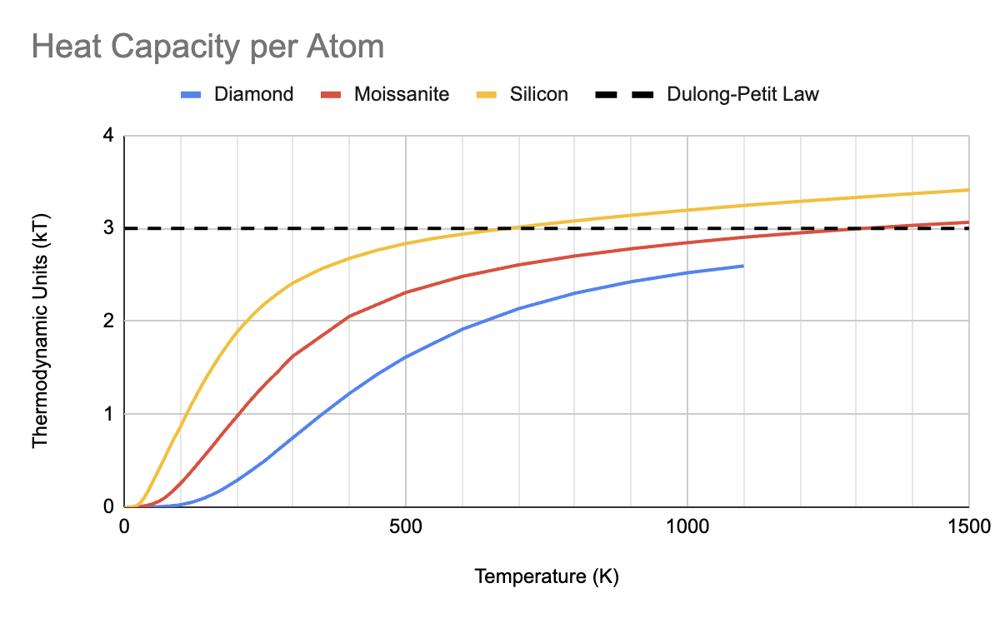
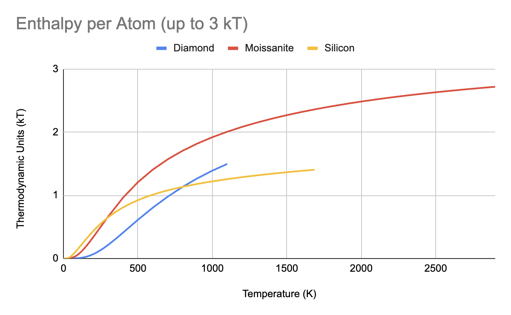

# Heat Capacity

This file was originally part of the MM4 library, but it didn't really belong there. It was relocated into the hardware catalog.

```swift
extension MM4RigidBody {  
  public func heatCapacity(temperature: Float) -> Float
}
```

Estimate of the heat capacity in kT.

This may not be the most appropriate number for characterizing thermal
properties. Molecular dynamics does not simulate certain quantum effects,
such as freezing of higher energy vibrational modes. Freezing is the
primary reason for diamond's exceptionally low heat capacity. Perform
simulations at both 3 kT and the estimated heat capacity (0.75-2.5 kT).
Report whether the system functions correctly and efficiently in both
sets of conditions.

Heat capacity is derived from data for C, SiC, and Si. The object is
matched to one of these materials based on its elemental composition.
- Elements with Z=6 to Z=8 are treated like carbon.
- Elements with Z=14 to Z=32 are treated like silicon.
- Heat capacity of octane (0.87 kT) is close to diamond (0.74 kT) at 298 K
  ([Gang et al., 1998](https://doi.org/10.1016/S0301-0104(97)00369-8)).
  Therefore, hydrogens and halogens likely have the same thermodynamic
  characteristics as whatever bulk they are attached to. These atoms are
  omitted from the enthalpy derivation.
- The elemental composition is mapped to a spectrum: 100% carbon to
  100% silicon. Moissanite falls at the halfway point. The result is
  interpolated between the two closest materials.

## Addendum: setThermalKineticEnergy

Originally, the MM4 library was planned to reproduce `setVelocitiesToTemperature` from OpenMM. This function would be aware of the actual heat capacity, which doesn't equal $\frac{1}{2}kT$ per degree of freedom. The planned API gradually evolved into something giving the user more control. Eventually, `heatCapacity` become optional with a default value of $\frac{1}{2}kT$ per DOF. It was clear that we really just wanted the same functionality as OpenMM for actual simulations.

When using `setVelocitiesToTemperature` directly, the function violates conservation of momentum. The old MM4 implementation automatically corrected for momentum drift, and the new MM4 implementation was originally planned to contain such functionality. However, a major overhaul to `MM4RigidBody` changed that plan. The overhaul made quantities like linear and angular momentum much easier to work with. It became feasible to script together some code for correcting momentum drift on the client side. Therefore, the code was relocated from `MM4` to the hardware catalog.

> WARNING: setVelocitiesToTemperature from OpenMM assumes masses are in `amu`. With the MM4 framework, masses are in a different unit: `yg`. Take extreme caution when setting thermal velocities, to make sure all units are correct. The formula from the function body below may be helpful. You can compute the expected energy per particle, in zJ. Then, compute the average energy of the generated thermal velocities. Assert that they agree with a 1&ndash;5% margin of error.

```swift
extension MM4RigidBody {
  public mutating func setThermalKineticEnergy(
    temperature: Float,
    heatCapacity: Float = 1.5
  ) {
    // E = thermal energy
    // C = heat capacity
    // N = number of atoms, excluding those with zero mass
    // k = Boltzmann constant
    // T = temperature
    //
    // E = N C kT
    
    let kT = Float(MM4BoltzInZJPerK) * temperature
    let particleEnergy = heatCapacity * kT
    storage.createThermalVelocities(particleEnergy: particleEnergy)
  }
}
```

Set the thermal kinetic energy to match a given temperature, assuming
positions are energy-minimized at 0 K.

- Parameter temperature: The temperature to match the thermal energy to,
  in kelvin.
- Parameter heatCapacity: The partitioning of overall thermal energy in
  thermodynamic units per atom (kT or R). The default value is 1.5.

Some of the energy will be lost to thermal potential energy during a
simulation. This information can technically be recovered from the atoms'
positions. Typical use cases minimize the system at 0 K, then initialize
the simulator at room temperature. It is not anticipated that users will
extract temperature (e.g. local temperature differentials) from the
simulation.

> WARNING: There is no trivial method to translate between thermal energy
and temperature. Therefore, you must find a heat capacity lookup table
from an external source. Diamond has
[significantly different](https://physics.stackexchange.com/a/583043) heat
capacity characteristics than other solids. In 1957, C. V. Raman devised a
[theoretical function](http://dspace.rri.res.in/bitstream/2289/1763/1/1957%20Proc%20Indian%20Acad%20Sci%20A%20V46%20p323-332.pdf)
to map temperature to heat capacity for diamond. Experimental measurements
matched the prediction with around 1% margin of error.

Heat capacity in kT/atom equals the value in J/mol-K divided by 8.314. For
reference, here are some common heat capacities:
- By the equipartition theorem, ideal gases are 1.5 kT.
- Most crystalline solids approach 3.0 kT at high temperatures.
- Diamond: 0.74 kT at 298 K, 1.62 kT at 500 K ([Raman, 1957](http://dspace.rri.res.in/bitstream/2289/1763/1/1957%20Proc%20Indian%20Acad%20Sci%20A%20V46%20p323-332.pdf)).
- Moissanite: 1.62 kT at 298 K, 2.31 kT at 500 K ([Chekhovskoy, 1971](https://doi.org/10.1016/S0021-9614(71)80045-9)).
- Silicon: 2.41 kT at 298 K, 2.84 kT at 500 K ([Desai, 1985](https://srd.nist.gov/JPCRD/jpcrd298.pdf)).



## Addendum: Material Enthalpies

While trying to make sense of the mismatch between the quantum and classical models of heat capacity, I examined enthalpy. This is the energy entered into a system starting from the zero-point energy at 0 Kelvin. I converted the heat capacities from kT into zJ, integrated over temperature, then converted back into kT at the destination temperature.

I think the line for silicon (yellow) is off by a factor of 2. I had to divide some stuff by 2 while converting molar heat capacity into atomic heat capacity for silicon carbide. 1 carbon atom + 1 silicon atom = 1 molar unit, but 2 atoms. That Google Sheets formula may have carried over into the column for silicon data. If the yellow line increases by a factor of 2, the graph seems to make more sense. The graph is not going to be regenerated, because it's considered irrelevant and is not maintenance worth investing time in.


