# Non-Carbon Elements

This file validates the accuracy of MM4 when handling elements besides carbon and hydrogen. It reports partial charges, bond lengths, and bond angles of notable functional groups. The results are compared to xTB.

Cross-terms containing torsions are deactivated. It is unclear to what degree they're required for first-row electronegative elements. Therefore, this analysis has avoided N/O/F so far.

Table of Contents
- [Bridgehead-Doped Adamantane](#bridgehead-doped-adamantane)
- [Sidewall-Doped Adamantane](#sidewall-doped-adamantane)
- [Elemental Silicon](#elemental-silicon)
- [Material Properties](#material-properties)

## Bridgehead-Doped Adamantane

### Si-Doped Adamantane

Adamantane, with one bridgehead carbon replaced with a silicon.

|                             | MM4Parameters | MM4ForceField | GFN2-xTB | GFN-FF  |
| --------------------------- | ------------- | ------------- | -------- | ------- |
| C charge (far from Si)      | 0.000         | 0.000         | \-0.063  | \-0.050 |
| C charge (close to Si)      | \-0.078       | \-0.078       | \-0.158  | \-0.066 |
| Si charge                   | 0.233         | 0.233         | 0.491    | 0.081   |
| H charge (on Si)            | 0.000         | 0.000         | \-0.098  | \-0.014 |
| C-C bond (far from Si)      | 1.531         | 1.547         | 1.530    | 1.558   |
| C-C bond (close to Si)      | 1.536         | 1.550         | 1.531    | 1.540   |
| C-Si bond                   | 1.876         | 1.870         | 1.896    | 1.875   |
| Si-H bond                   | 1.483         | 1.482         | 1.466    | 1.480   |
| C-C-C angle (most strained) | 111.8         | 113.1         | 113.3    | 112.8   |
| C-C-Si angle                | 111.5         | 106.8         | 106.9    | 106.9   |
| C-Si-C angle                | 110.4         | 104.0         | 102.6    | 103.9   |
| Si-C-H angle                | 110.0         | 110.4         | 112.2    | 108.8   |
| C-Si-H angle                | 109.3         | 114.5         | 115.7    | 114.6   |

### Silicon Carbide

Adamantane, with each bridgehead carbon replaced with a silicon.

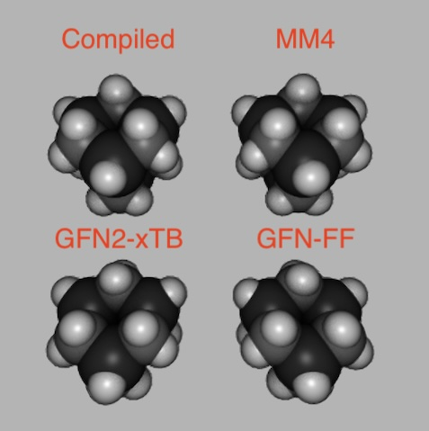

|                  | MM4Parameters | MM4ForceField | GFN2-xTB | GFN-FF  |
| ---------------- | ------------- | ------------- | -------- | ------- |
| H charge (on C)  | 0.000         | 0.000         | 0.011    | 0.022   |
| H charge (on Si) | 0.000         | 0.000         | \-0.107  | \-0.069 |
| C charge         | \-0.155       | \-0.155       | \-0.271  | \-0.091 |
| Si charge        | 0.233         | 0.233         | 0.480    | 0.311   |
| C-Si bond        | 1.879         | 1.880         | 1.903    | 1.872   |
| C-H bond         | 1.112         | 1.112         | 1.088    | 1.088   |
| Si-H bond        | 1.487         | 1.487         | 1.482    | 1.451   |
| Si-C-Si angle    | 117.0         | 111.8         | 111.9    | 108.6   |
| C-Si-C angle     | 110.4         | 108.3         | 108.2    | 109.8   |
| H-C-Si angle     | 110.0         | 109.5         | 109.6    | 110.0   |
| H-Si-C angle     | 109.3         | 110.6         | 110.7    | 109.0   |
| H-C-H angle      | 107.7         | 107.1         | 106.2    | 108.8   |

### P-Doped Adamantane

Adamantane, with one bridgehead carbon replaced with a phosphorus.

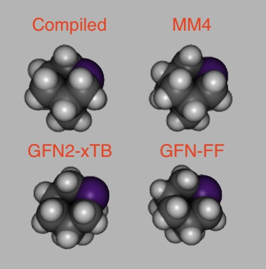

|                             | MM4Parameters | MM4ForceField | GFN2-xTB | GFN-FF  |
| --------------------------- | ------------- | ------------- | -------- | ------- |
| C charge (far from P)       | 0.000         | 0.000         | \-0.056  | \-0.049 |
| C charge (close to P)       | 0.105         | 0.105         | \-0.048  | \-0.057 |
| P charge                    | \-0.314       | \-0.314       | \-0.119  | 0.026   |
| C-C bond (far from P)       | 1.527         | 1.536         | 1.528    | 1.551   |
| C-C bond (close to P)       | 1.527         | 1.538         | 1.527    | 1.534   |
| C-P bond                    | 1.844         | 1.856         | 1.856    | 1.834   |
| C-H bond (close to P)       | 1.111         | 1.112         | 1.095    | 1.0926  |
| C-C-C angle (most strained) | 111.8         | 111.4         | 111.2    | 111.4   |
| C-C-P angle                 | 109.6         | 113.8         | 114.3    | 112.2   |
| C-P-C angle                 | 94.5          | 97.9          | 97.2     | 100.2   |
| P-C-H angle                 | 108.3         | 107.8         | 107.3    | 107.3   |

### Carbon Phosphide

Adamantane, with each bridgehead carbon replaced with a phosphorus.

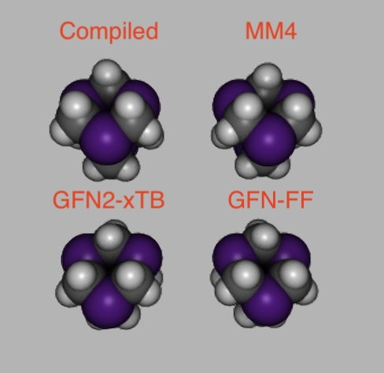

|             | MM4Parameters | MM4ForceField | GFN2-xTB | GFN-FF  |
| ----------- | ------------- | ------------- | -------- | ------- |
| H charge    | 0.000         | 0.000         | 0.058    | 0.026   |
| C charge    | 0.209         | 0.209         | \-0.031  | \-0.068 |
| P charge    | \-0.313       | \-0.313       | \-0.127  | 0.026   |
| C-P bond    | 1.846         | 1.842         | 1.853    | 1.828   |
| C-H bond    | 1.110         | 1.110         | 1.098    | 1.088   |
| P-C-P angle | 109.5         | 125.0         | 124.0    | 120.7   |
| C-P-C angle | 94.5          | 100.7         | 101.3    | 103.4   |
| H-C-P angle | 108.3         | 106.2         | 106.3    | 107.1   |
| H-C-H angle | 107.7         | 105.7         | 106.6    | 107.2   |

### Ge-Doped Adamantane

Adamantane, with one bridgehead carbon replaced with a germanium.

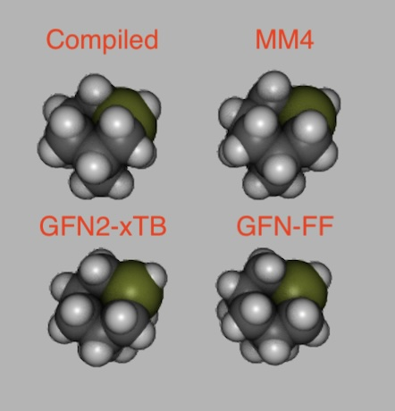

|                             | MM4Parameters | MM4ForceField | GFN2-xTB | GFN-FF  |
| --------------------------- | ------------- | ------------- | -------- | ------- |
| C charge (far from Ge)      | 0.000         | 0.000         | \-0.048  | \-0.051 |
| C charge (close to Ge)      | \-0.068       | \-0.068       | \-0.100  | \-0.076 |
| Ge charge                   | 0.203         | 0.203         | 0.153    | 0.168   |
| H charge (on Ge)            | 0.000         | 0.000         | \-0.011  | \-0.035 |
| C-C bond (far from Ge)      | 1.527         | 1.545         | 1.530    | 1.560   |
| C-C bond (close to Ge)      | 1.527         | 1.544         | 1.531    | 1.541   |
| C-Ge bond                   | 1.949         | 1.945         | 1.971    | 1.947   |
| Ge-H bond                   | 1.555         | 1.554         | 1.521    | 1.557   |
| C-C-C angle (most strained) | 111.8         | 113.5         | 114.0    | 114.0   |
| C-C-Ge angle                | 109.3         | 105.8         | 105.7    | 104.5   |
| C-Ge-C angle                | 109.8         | 102.7         | 101.8    | 104.3   |
| Ge-C-H angle                | 111.9         | 111.6         | 112.4    | 109.4   |
| C-Ge-H angle                | 110.2         | 115.6         | 116.4    | 114.3   |

### Germanium Carbide

Adamantane, with each bridgehead carbon replaced with a germanium.

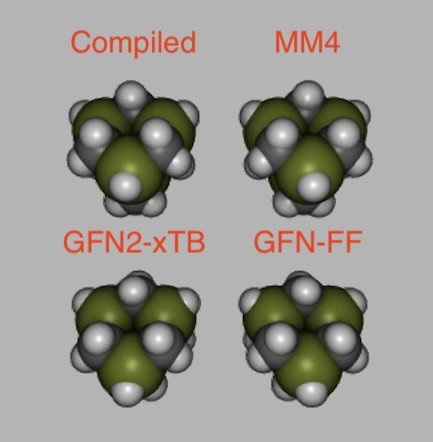

|                  | MM4Parameters | MM4ForceField | GFN2-xTB | GFN-FF  |
| ---------------- | ------------- | ------------- | -------- | ------- |
| H charge (on C)  | 0.000         | 0.000         | 0.043    | 0.016   |
| H charge (on Ge) | 0.000         | 0.000         | \-0.058  | \-0.034 |
| C charge         | \-0.136       | \-0.136       | \-0.157  | \-0.106 |
| Ge charge        | 0.203         | 0.203         | 0.165    | 0.146   |
| C-Ge bond        | 1.949         | 1.951         | 1.975    | 1.967   |
| C-H bond         | 1.112         | 1.112         | 1.090    | 1.087   |
| Ge-H bond        | 1.552         | 1.552         | 1.535    | 1.538   |
| Ge-C-Ge angle    | 112.0         | 109.8         | 109.8    | 109.1   |
| C-Ge-C angle     | 109.8         | 109.3         | 109.3    | 109.7   |
| H-C-Ge angle     | 111.9         | 110.2         | 109.8    | 109.7   |
| H-Ge-C angle     | 110.2         | 109.6         | 109.6    | 109.3   |
| H-C-H angle      | 107.7         | 106.4         | 107.6    | 108.9   |

## Sidewall-Doped Adamantane

### Si-Doped Adamantane

Adamantane, with one sidewall carbon replaced with a silicon.

|                                 | MM4Parameters | MM4ForceField | GFN2-xTB | GFN-FF  |
| ------------------------------- | ------------- | ------------- | -------- | ------- |
| C charge (once removed from Si) | 0.000         | 0.000         | \-0.058  | \-0.211 |
| C charge (close to Si)          | \-0.078       | \-0.078       | \-0.114  | 0.427   |
| Si charge                       | 0.155         | 0.155         | 0.476    | \-0.208 |
| H charge (on Si)                | 0.000         | 0.000         | \-0.092  | 0.007   |
| C-C bond (once removed from Si) | 1.531         | 1.549         | 1.530    | 1.641   |
| C-C bond (close to Si)          | 1.536         | 1.551         | 1.530    | 1.624   |
| C-Si bond                       | 1.876         | 1.872         | 1.897    | 1.908   |
| Si-H bond                       | 1.483         | 1.483         | 1.467    | 1.434   |
| C-C-C angle (closest to Si)     | 111.8         | 112.2         | 112.0    | 114.9   |
| C-C-Si angle                    | 112.7         | 108.4         | 108.7    | 105.4   |
| C-Si-C angle                    | 109.2         | 97.6          | 95.6     | 105.0   |
| Si-C-H angle                    | 109.5         | 109.8         | 112.5    | 108.8   |
| C-Si-H angle                    | 107.0         | 111.9         | 112.5    | 110.8   |
| H-Si-H angle                    | 106.5         | 110.9         | 110.7    | 108.7   |

### Silicon Carbide

Adamantane, with each sidewall carbon replaced with a silicon.

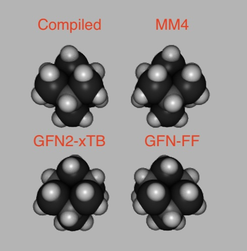

|                  | MM4Parameters | MM4ForceField | GFN2-xTB | GFN-FF  |
| ---------------- | ------------- | ------------- | -------- | ------- |
| H charge (on C)  | 0.000         | 0.000         | \-0.006  | \-0.133 |
| H charge (on Si) | 0.000         | 0.000         | \-0.123  | 0.009   |
| C charge         | \-0.233       | \-0.233       | \-0.344  | 0.416   |
| Si charge        | 0.155         | 0.155         | 0.480    | \-0.206 |
| C-Si bond        | 1.877         | 1.881         | 1.901    | 1.902   |
| C-H bond         | 1.112         | 1.112         | 1.090    | 1.133   |
| Si-H bond        | 1.488         | 1.488         | 1.476    | 1.437   |
| Si-C-Si angle    | 119.5         | 111.0         | 110.7    | 108.5   |
| C-Si-C angle     | 109.2         | 106.3         | 107.0    | 111.4   |
| H-C-Si angle     | 109.5         | 107.9         | 108.2    | 110.4   |
| H-Si-C angle     | 107.0         | 110.5         | 110.7    | 109.4   |
| H-Si-H angle     | 106.5         | 108.8         | 110.7    | 107.9   |

### S-Doped Adamantane

Adamantane, with one sidewall carbon replaced with a sulfur.

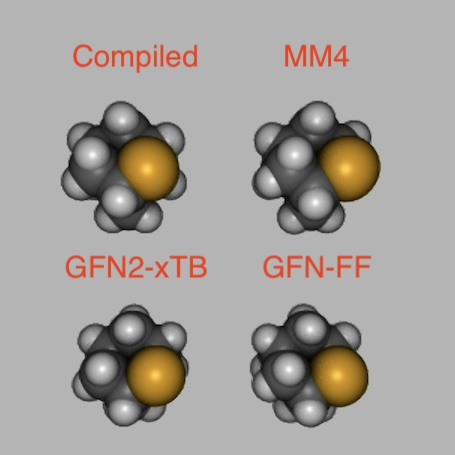

|                                | MM4Parameters | MM4ForceField | GFN2-xTB | GFN-FF  |
| ------------------------------ | ------------- | ------------- | -------- | ------- |
| C charge (once removed from S) | 0.000         | 0.000         | \-0.056  | \-0.047 |
| C charge (close to S)          | 0.080         | 0.080         | 0.040    | \-0.010 |
| S charge                       | \-0.161       | \-0.161       | \-0.229  | \-0.120 |
| C-C bond (once removed from S) | 1.527         | 1.538         | 1.530    | 1.551   |
| C-C bond (close to S)          | 1.526         | 1.539         | 1.523    | 1.544   |
| C-S bond                       | 1.814         | 1.828         | 1.826    | 1.799   |
| C-H bond (close to S)          | 1.097         | 1.099         | 1.093    | 1.101   |
| C-C-C angle (closest to S)     | 111.8         | 111.9         | 110.9    | 110.9   |
| C-C-S angle                    | 105.7         | 107.6         | 109.6    | 110.2   |
| C-S-C angle                    | 97.2          | 98.5          | 95.0     | 96.6    |
| S-C-H angle                    | 108.9         | 109.0         | 104.8    | 106.2   |

### Carbon Sulfide

Adamantane, with each sidewall carbon replaced with a sulfur.

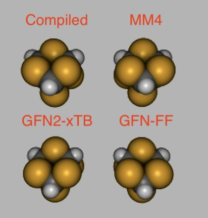

|             | MM4Parameters | MM4ForceField | GFN2-xTB | GFN-FF  |
| ----------- | ------------- | ------------- | -------- | ------- |
| H charge    | 0.000         | 0.000         | 0.089    | 0.065   |
| C charge    | 0.241         | 0.241         | 0.100    | 0.007   |
| S charge    | \-0.161       | \-0.161       | \-0.126  | \-0.048 |
| C-S bond    | 1.814         | 1.813         | 1.819    | 1.793   |
| C-H bond    | 1.082         | 1.082         | 1.090    | 1.094   |
| S-C-S angle | 110.0         | 113.1         | 113.7    | 113.3   |
| C-S-C angle | 97.2          | 101.6         | 100.2    | 101.2   |
| H-C-S angle | 108.9         | 105.6         | 104.8    | 105.3   |

### Ge-Doped Adamantane

Adamantane, with one sidewall carbon replaced with a germanium.

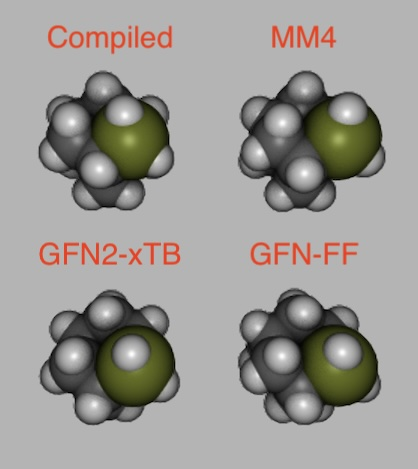

|                                 | MM4Parameters | MM4ForceField | GFN2-xTB | GFN-FF  |
| ------------------------------- | ------------- | ------------- | -------- | ------- |
| C charge (once removed from Ge) | 0.000         | 0.000         | \-0.054  | \-0.050 |
| C charge (close to Ge)          | \-0.068       | \-0.068       | \-0.055  | \-0.055 |
| Ge charge                       | 0.136         | 0.136         | 0.126    | 0.162   |
| H charge (on Ge)                | 0.000         | 0.000         | \-0.012  | \-0.032 |
| C-C bond (once removed from Ge) | 1.527         | 1.547         | 1.531    | 1.560   |
| C-C bond (close to Ge)          | 1.527         | 1.545         | 1.528    | 1.542   |
| C-Ge bond                       | 1.949         | 1.949         | 1.977    | 1.957   |
| Ge-H bond                       | 1.555         | 1.554         | 1.510    | 1.548   |
| C-C-C angle (closest to Ge)     | 111.8         | 113.0         | 112.6    | 112.5   |
| C-C-Ge angle                    | 109.3         | 107.3         | 107.4    | 106.2   |
| C-Ge-C angle                    | 110.5         | 96.2          | 94.1     | 97.9    |
| Ge-C-H angle                    | 110.0         | 110.7         | 113.4    | 108.7   |
| C-Ge-H angle                    | 110.5         | 112.6         | 113.7    | 111.0   |
| H-Ge-H angle                    | 107.5         | 109.6         | 107.8    | 113.8   |

### Germanium Carbide

Adamantane, with each sidewall carbon replaced with a germanium.

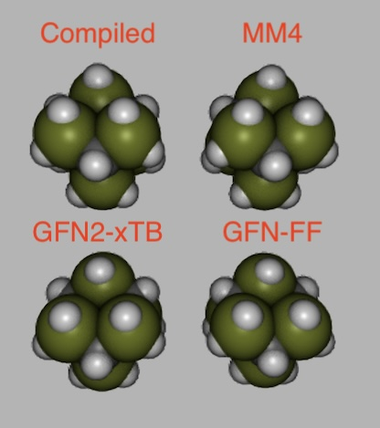

|                  | MM4Parameters | MM4ForceField | GFN2-xTB | GFN-FF  |
| ---------------- | ------------- | ------------- | -------- | ------- |
| H charge (on C)  | 0.000         | 0.000         | 0.032    | 0.031   |
| H charge (on Ge) | 0.000         | 0.000         | \-0.034  | \-0.024 |
| C charge         | \-0.203       | \-0.203       | \-0.167  | 0.026   |
| Ge charge        | 0.136         | 0.136         | 0.158    | \-0.171 |
| C-Ge bond        | 1.949         | 1.954         | 1.971    | 1.914   |
| C-H bond         | 1.112         | 1.112         | 1.091    | 1.088   |
| Ge-H bond        | 1.552         | 1.552         | 1.518    | 1.491   |
| Ge-C-Ge angle    | 112.0         | 109.8         | 109.7    | 109.3   |
| C-Ge-C angle     | 110.5         | 108.8         | 109.0    | 109.8   |
| H-C-Ge angle     | 110.0         | 109.1         | 109.2    | 109.6   |
| H-Ge-C angle     | 110.5         | 110.4         | 110.2    | 109.6   |
| H-Ge-H angle     | 107.5         | 106.5         | 107.2    | 108.6   |

## Elemental Silicon

Investigate the quaternary silicon atom. Is the MM3 parameter for Si-Si-Si bond angle correct? Does it hold true in pure elemental form, or only when bonded to carbon?

Based on this investigation, it looks like 118° is correct. Which parameter is used doesn't affect bulk silicon (di-adamantasilane). It also doesn't affect compounds that lack a quaternary Si-Si-Si bond (6-carbon doped variant). For the 2-carbon and 4-carbon variants, the RMS error between MM4 and GFN2-xTB greatly decreases when using the 118° parameter.

### Di-Adamantasilane

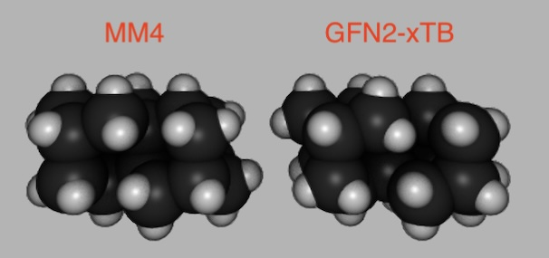

|                            | 118° | 109.5° | GFN2-xTB |
| -------------------------- | ------ | ------ | ------ |
| Si charge (bulk)           |  0.000 |  0.000 |  0.080 |
| Si-Si (sidewall)           |  2.325 |  2.322 |  2.346 |
| Si-Si (bridgehead)         |  2.329 |  2.326 |  2.374 |
| Si-Si (bulk)               |  2.333 |  2.328 |  2.428 |
| Si-Si-Si (sidewall)        |  110.1 |  110.2 |  113.5 |
| Si-Si-Si (bridgehead)      |  109.2 |  109.2 |  110.1 |
| Si-Si-Si (bulk 1)          |  109.8 |  110.0 |  108.3 |
| Si-Si-Si (bulk 2)          |  109.3 |  109.3 |  106.8 |
| Si-Si-Si (bulk 3)          |  109.7 |  109.7 |  113.3 |
| Si-Si-Si (bulk 4)          |  109.1 |  109.0 |  107.9 |

### Di-Adamantasilane (2-Carbon Doped)

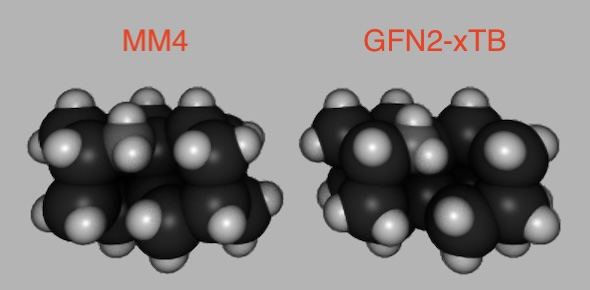

|                            | 118° | 109.5° | GFN2-xTB |
| -------------------------- | ------ | ------ | ------ |
| H charge (on sidewall C)   |  0.000 |  0.000 | -0.030 |
| C charge (sidewall)        | -0.154 | -0.154 | -0.285 |
| Si charge (bulk)           |  0.077 |  0.077 |  0.198 |
| Si-Si (sidewall)           |  2.326 |  2.324 |  2.346 |
| Si-Si (bridgehead)         |  2.322 |  2.324 |  2.374 |
| Si-Si (bulk)               |  2.325 |  2.328 |  2.394 |
| C-Si (sidewall)            |  1.916 |  1.914 |  1.933 |
| Si-Si-Si (sidewall)        |  108.4 |  107.8 |  110.9 |
| Si-Si-Si (bridgehead 1)    |  111.7 |  111.0 |  113.4 |
| Si-Si-Si (bridgehead 2)    |  102.3 |  104.6 |  101.4 |
| Si-C-Si (sidewall)         |  120.4 |  119.6 |  124.1 |
| Si-Si-Si (bulk 1)          |  108.2 |  106.4 |  107.0 |
| Si-Si-Si (bulk 2)          |  112.0 |  108.9 |  111.2 |
| Si-Si-Si (bulk 3)          |  110.1 |  107.6 |  113.9 |
| C-Si-Si (bulk 1)           |  108.1 |  111.2 |  104.3 |
| C-Si-Si (bulk 2)           |  109.1 |  111.0 |  111.2 |
| C-Si-Si (bulk 3)           |  109.3 |  111.5 |  108.9 |

### Di-Adamantasilane (4-Carbon Doped)

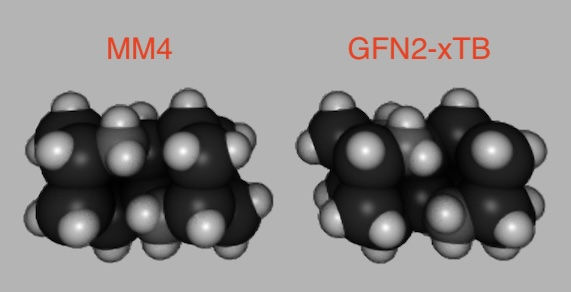

|                            | 118° | 109.5° | GFN2-xTB |
| -------------------------- | ------ | ------ | ------ |
| H charge (on sidewall C)   |  0.000 |  0.000 | -0.018 |
| C charge (sidewall)        | -0.154 | -0.154 | -0.282 |
| Si charge (bulk)           |  0.154 |  0.154 |  0.292 |
| Si-Si (bridgehead)         |  2.318 |  2.323 |  2.363 |
| Si-Si (bulk)               |  2.324 |  2.333 |  2.360 |
| C-Si (sidewall)            |  1.908 |  1.907 |  1.924 |
| Si-Si-Si (bridgehead)      |  104.7 |  106.3 |  103.6 |
| Si-C-Si (sidewall)         |  118.6 |  118.1 |  121.9 |
| Si-Si-Si (bulk)            |  106.6 |  103.0 |  107.2 |
| C-Si-C (bulk)              |  112.8 |  113.2 |  109.5 |
| C-Si-Si (bulk 1)           |  109.4 |  110.8 |  108.4 |
| C-Si-Si (bulk 2)           |  109.2 |  109.3 |  111.6 |
| C-Si-Si (bulk 3)           |  109.4 |  110.7 |  108.4 |
| C-Si-Si (bulk 4)           |  109.2 |  109.3 |  111.6 |

### Di-Adamantasilane (6-Carbon Doped)

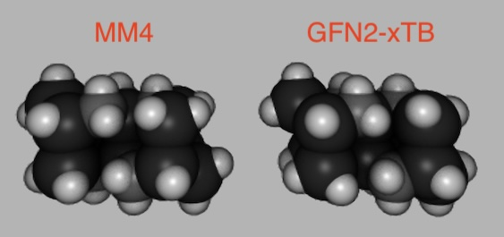

|                            | 118° | 109.5° | GFN2-xTB |
| -------------------------- | ------ | ------ | ------ |
| H charge (on sidewall C)   |  0.000 |  0.000 | -0.000 |
| H charge (on bridgehead C) |  0.000 |  0.000 |  0.001 |
| C charge (sidewall)        | -0.154 | -0.154 | -0.286 |
| C charge (bridgehead)      | -0.233 | -0.233 | -0.347 |
| Si charge (bulk)           |  0.232 |  0.232 |  0.386 |
| Si-Si (bulk)               |  2.338 |  2.338 |  2.320 |
| C-Si (sidewall)            |  1.898 |  1.898 |  1.918 |
| C-Si (bridgehead)          |  1.890 |  1.890 |  1.924 |
| Si-C-Si (sidewall)         |  115.9 |  115.9 |  115.7 |
| Si-C-Si (bridgehead)       |  112.5 |  112.5 |  111.6 |
| C-Si-C (bulk 1)            |  111.4 |  111.4 |  111.2 |
| C-Si-C (bulk 2)            |  110.5 |  110.5 |  108.7 |
| C-Si-Si (bulk 1)           |  106.6 |  106.6 |  106.7 |
| C-Si-Si (bulk 2)           |  108.4 |  108.4 |  109.5 |

## Material Properties

This is an investigation that ought to be performed, to investigate the correctness of MM4. In theory, it should reproduce the bulk material properties of every compound. The structures will be too large to study in a reasonable amount of time with GFN2-xTB. The cheaper GFN-FF has known deficiencies when modeling these compounds.

TODO:
- Measure density and lattice constant
- Measure elastic/shear/flexural modulus
- Compare lattice-scaled moduli of different materials
- Compare to empirical data

Materials:
- Diamond
- Moissanite
- Germanium Carbide
- Silicon
- All materials are cubic, with reconstructed (100) surfaces.
