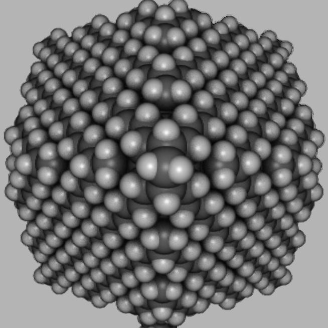

# Rhombic Dodecahedron

Author: Philip Turner

  
&nbsp; &nbsp; &nbsp; &nbsp;
  

Description: a rotationally symmetric rhombic dodecahedron.

Parameters:
- Width (Int) - To avoid stray methyl carbons, a value produced by the formulas `4n + 1` or `4n + 2` is encouraged. Otherwise, explicitly trim off the stray methyl group. In the near future, the part will be changed to remove stray carbons, without creating a `V2` part.

Improvements: sometimes, a rhombic dodecahedron-like shape with uneven dimensions may be the most appropriate for a specific use case. For example, an object with a perimeter like a rhombic dodecahedron, but elongated to create a very large, open (110) surface. Such a shape is beyond the scope of this part, but can be created using similar principles. The source code is shown in this folder.
