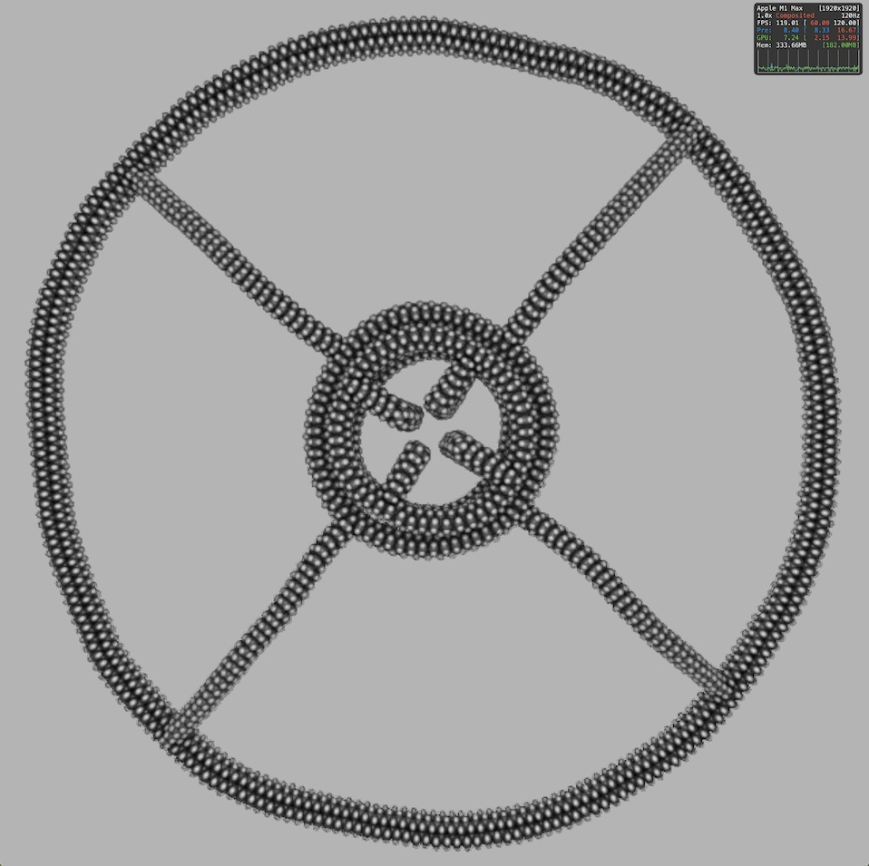
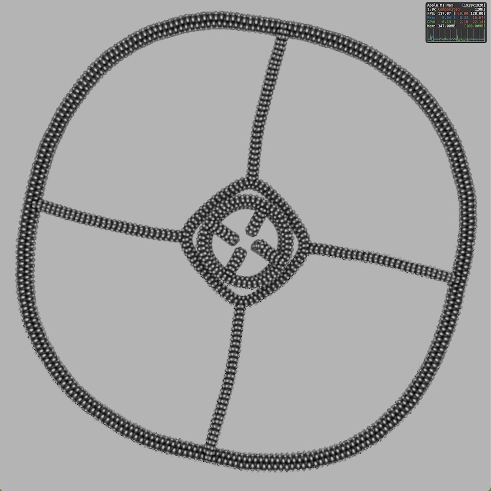

# Ring

> ⚠️⚠️⚠️ WARNING: This crystolecule likely cannot be manufactured. However, it is needed to create a constant current source for controlled motions _in silico_.

Author: Philip Turner

  
&nbsp; &nbsp; &nbsp; &nbsp;
  

> Left: spinning at 1050 m/s, right: spinning at 4200 m/s. The flywheel in each image is two rings superimposed. The outer ring only has inner spokes, while the inner ring only has outer spokes. The two rings are overlaid using CSG, as the non-warped part aligns with the crystal lattice.

Description: a strained shell structure built out of diamond rope, optionally with spokes pointing toward the center or away from the edge.

Parameters:
- Radius (Float) - Approximate number of diagonal unit cells (`1.414 * 0.357` nanometers = 1 cell) from center to perimeter. This is not exact because of some internal implementation details.
- Perimeter (Int) - Number of crystal unit cells placed diagonally to generate the perimeter.
- Thickness (Float) - Thickness of the diamond rope in the XZ plane. Currently non-functional unless the value is `1.0`.
- Depth (Float) - Thickness of the diamond rope in the Y direction. Currently non-functional unless the value is `1.5`.
- Inner Spokes (Bool) - Whether to include inner spokes, going from `r = 0` to `r = radius`.
- Outer Spokes (Bool) - Whether to include outer spokes, going from `r = radius` to `r = 2 * radius`.

Improvements: the part could be improved to add gear tooth connectors around the edges, with fourfold radial symmetry.
