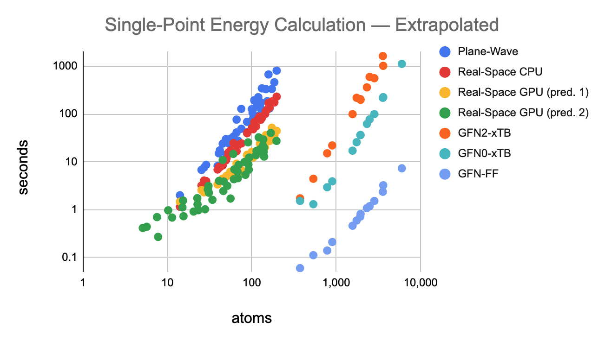
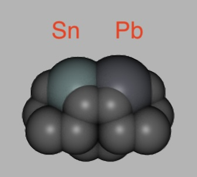
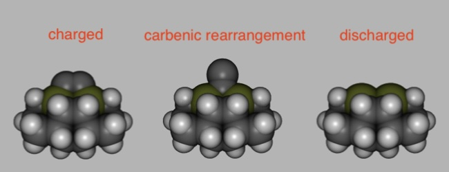
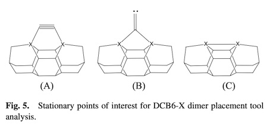
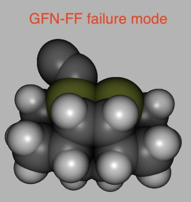

# Diamond Mechanosynthesis Tooltips

The following experiment uses three simulation techniques: real-space DFT, GFN2-xTB, GFN-FF. At the time of writing, the real-space DFT simulator only ran on CPU. It also didn't employ the DM21 exchange-correlation functional. Preceding [literature](https://github.com/philipturner/diamond-mechanosynthesis-literature-review) used plane-wave DFT and AM1.

This will be the first time the following workflow is attempted:
- Preconditioning: GFN-FF
- Minimization: GFN2-xTB
- Final singlepoint analysis: DFT



## Choice of DFT Library

Octopus is the fastest library for DFT, on both CPU and GPU. It was predicted that the easiest approach was learning Octopus, then porting it to the Apple GPU. After several hours of trying, I could not install or compile Octopus.

I gave up and went with GOSPEL. Being written in Python, it encounters none of the issues from outdated/failing Fortran compilers. I can use it directly from Swift via PythonKit, which is very nice. It may also be easier to modify. I can inject the DM21 functional with just a few lines of source code. I can also optimize GOSPEL by incrementally migrating portions of the Python code to Swift. The Octopus codebase can still be looked at. Even if it doesn't compile, one can reproduce the algorithms that make it so fast.

After compiling the PyLibXC bindings from scratch and injecting the arm64 dylib into the bindings folder, I got a successful execution. The energies differ from the expected values by an average of ~13%.

```swift
import Foundation
import PythonKit

PythonLibrary.useLibrary(at: "/Users/philipturner/miniforge3/bin/python")

let GOSPEL = Python.import("gospel.calculator").GOSPEL
let bulk = Python.import("ase.build").bulk
let Ha = Python.import("ase.units").Ha
print(GOSPEL)
print(bulk)
print(Ha)

let atoms = bulk("Si", "diamond", a: 5.43, cubic: true)
let calc = GOSPEL(
  grid: ["spacing":0.25],
  pp: ["upf":["/Users/philipturner/Documents/OpenMM/GOSPEL/tests/DATA/Si.pbe-n-nc.UPF"]],
  xc: ["type":"gga_x_pbe + gga_c_pbe"],
  convergence: ["density_tol":1e-5,
                "orbital_energy_tol":1e-5],
  occupation: [PythonObject("smearing"): PythonObject("Fermi-Dirac"),
               PythonObject("temperature"): PythonObject(0.01)])
atoms.calc = calc
let energy = atoms.get_potential_energy()
let fermi_level = calc.fermi_level
let band_gap = calc.band_gap

// The repository's Python script expects:
// energy = -31.1834133
// fermi_level = 4.63415316
// band_gap = 0.544

// Console output:
/*
 ============ Energy (Hartree) ==============
 |   Total Energy        : -38.3573241472   |
 --------------------------------------------
 | * Ion-ion Energy      : 0.0              |
 | * Eigenvals sum for 0 : -0.9187279427    |
 | * Hartree Energy      : 13.7191167575    |
 | * XC Energy           : -17.5471121454   |
 | * Kinetic Energy      : 13.0629049274    |
 | * External Energy     : -54.4786106028   |
 | * Non-local Energy    : 6.886376916      |
 ============================================
 Elapsed time[calc_and_print_energies]: 0.016855955123901367 sec
 Total Energy: -38.35732414724355 Ha
 Fermi Level : 4.245902105998337 eV
 Gap: 0.592 eV
 Transition (v -> c):
   (s=0, k=0, n=15, [0.00, 0.00, 0.00]) -> (s=0, k=0, n=16, [0.00, 0.00, 0.00])
 */
```

I will begin by reproducing the tooltips from Robert Freitas's first paper. Run them through xTB, then compare the structures and energies to the literature. Finally, get GOSPEL to accept the structures and output something about them.

## Tooltips

I had to make some modifications to `MolecularRendererApp`. The module was originally built to reproduce NanoEngineer + QuteMol as closely as possible. NanoEngineer only had a full parameter set for Z=1 to Z=36. To render Au(111) surfaces for early mechanosynthesis, Z=79 was added in ~June 2023. The DMS tooltips project required new rendering parameters for tin and lead.

<div align="center">



| Element    | Z   | Radius  | Color |
| :--------: | :-: | :-----: | :---: |
| Copper     |  29 | 2.325 Å | $\color{rgb(200, 128,  51)}{\texttt{200, 128,  51}}$ |
| Germanium  |  32 | 1.938 Å | $\color{rgb(102, 115,  26)}{\texttt{102, 115,  26}}$ |
| Tin (new)  |  50 | 2.227 Å | $\color{rgb(102, 128, 128)}{\texttt{102, 128, 128}}$ |
| Gold       |  79 | 2.623 Å | $\color{rgb(212, 175,  55)}{\texttt{212, 175,  55}}$ |
| Lead (new) |  82 | 2.339 Å | $\color{rgb( 87,  89,  97)}{\texttt{ 87,  89,  97}}$ |

</div>

Here are the compiled structures for each DCB6-Ge stationary point. The structures are compared to the schematic from the literature. Other tooltip variants will be rendered once they are all minimized.

<div align="center">





</div>

To run the tooltips through xTB, we had to know how many unpaired electrons existed in the carbenic rearrangements. A C<sub>2</sub>H<sub>2</sub> molecule was created where both hydrogens were attached to the first carbon. They formed 120° angles with each other and the second carbon.

The parameter `--uhf` was set to 0, meaning no unpaired electrons. Next, `--uhf` was set to 2. Each configuration was minimized and the final singlepoint was analyzed. The first one is lower in total energy by -0.091 Hartree (-2.47 eV). Therefore, it is the most stable structure. Tooltip calculations will set the `--uhf` flag to 0.

```
xtb coord --input xtb.inp --opt --uhf 0

           -------------------------------------------------
          | TOTAL ENERGY               -5.120053767132 Eh   |
          | GRADIENT NORM               0.000304950057 Eh/α |
          | HOMO-LUMO GAP               2.494435088648 eV   |
           -------------------------------------------------

xtb coord --input xtb.inp --opt --uhf 2

           -------------------------------------------------
          | TOTAL ENERGY               -5.029428635938 Eh   |
          | GRADIENT NORM               0.000447854607 Eh/α |
          | HOMO-LUMO GAP               2.781488566362 eV   |
           -------------------------------------------------
```

Next, I benchmarked the act of preconditioning the minimization with GFN-FF. In an earlier study with extremely far-from-equilibrium adamantasilanes, preconditioning reduced execution time by 3x. The technique is to first minimize the structure with GFN-FF, then minimize it again with GFN2-xTB.

The structures with and without preconditioning were practically equivalent. Their total energies differed by &lt;0.001 eV and their HOMO-LUMO gaps differed by 0.003 eV. The total execution time speedup was 1.43x. However, large quantities of structures will be solved in parallel to increase CPU utilization. In this context, the reduction in CPU-minutes was 1.46x.

```
// Run the original structure directly through GFN2-xTB.
xtb coord --input xtb.inp --opt

           -------------------------------------------------
          | TOTAL ENERGY              -58.859507835885 Eh   |
          | GRADIENT NORM               0.000571068136 Eh/α |
          | HOMO-LUMO GAP               2.639553942984 eV   |
           -------------------------------------------------

 total:
 * wall-time:     0 d,  0 h,  0 min,  4.820 sec
 *  cpu-time:     0 d,  0 h,  0 min, 19.956 sec
 * ratio c/w:     4.140 speedup

// Precondition the structure with GFN-FF.
xtb coord --input xtb.inp --opt --gfnff

           -------------------------------------------------
          | TOTAL ENERGY               -7.522732651943 Eh   |
          | GRADIENT NORM               0.000588677819 Eh/α |
           -------------------------------------------------
           
 total:
 * wall-time:     0 d,  0 h,  0 min,  0.175 sec
 *  cpu-time:     0 d,  0 h,  0 min,  0.271 sec
 * ratio c/w:     1.550 speedup
 
// Run the preconditioned structure through GFN2-xTB.
xtb coord --input xtb.inp --opt
 
           -------------------------------------------------
          | TOTAL ENERGY              -58.859508691701 Eh   |
          | GRADIENT NORM               0.000239990773 Eh/α |
          | HOMO-LUMO GAP               2.636769310805 eV   |
           -------------------------------------------------

 total:
 * wall-time:     0 d,  0 h,  0 min,  3.189 sec
 *  cpu-time:     0 d,  0 h,  0 min, 13.334 sec
 * ratio c/w:     4.181 speedup
```

Finally, each stationary point's energy is computed for DCB6-Ge. The energy of an isolated CC dimer is computed with 0, 2, and 4 unpaired electrons. With all of this data, we can reproduce an entry of "Table I" from the JNNDimerTool paper. This is a litmus test to troubleshoot problems before a large-scale production simulation.

> NOTE: I forgot to precondition the following minimizations with GFN-FF.

Tooltip structures:

```swift
let tooltipLHS: Element = .germanium
let tooltipRHS: Element = .germanium
let tooltipState: TooltipState = .charged
```

```
 C  H  Rav=1.0950 sigma=0.0035  Rmin=1.0891  Rmax=1.0996    24
 C  C  Rav=1.5190 sigma=0.0612  Rmin=1.2392  Rmax=1.5503    22
 Ge C  Rav=1.9765 sigma=0.0459  Rmin=1.9006  Rmax=2.0130     8
  
           -------------------------------------------------
          | TOTAL ENERGY              -58.859507837580 Eh   |
          | GRADIENT NORM               0.000571407150 Eh/α |
          | HOMO-LUMO GAP               2.639577034383 eV   |
           -------------------------------------------------
```

```swift
let tooltipLHS: Element = .germanium
let tooltipRHS: Element = .germanium
let tooltipState: TooltipState = .carbenicRearrangement
```

```
 C  H  Rav=1.0949 sigma=0.0038  Rmin=1.0882  Rmax=1.0998    24
 C  C  Rav=1.5196 sigma=0.0573  Rmin=1.2585  Rmax=1.5589    22
 Ge C  Rav=2.0019 sigma=0.0124  Rmin=1.9895  Rmax=2.0226     8
 Ge Ge Rav=2.8518 sigma=0.0000  Rmin=2.8518  Rmax=2.8518     1
  
           -------------------------------------------------
          | TOTAL ENERGY              -58.832328386449 Eh   |
          | GRADIENT NORM               0.000563952957 Eh/α |
          | HOMO-LUMO GAP               2.105831008948 eV   |
           -------------------------------------------------
```

```swift
let tooltipLHS: Element = .germanium
let tooltipRHS: Element = .germanium
let tooltipState: TooltipState = .discharged
```

```
 C  H  Rav=1.0960 sigma=0.0041  Rmin=1.0908  Rmax=1.1026    24
 C  C  Rav=1.5275 sigma=0.0080  Rmin=1.5099  Rmax=1.5532    21
 Ge C  Rav=2.0320 sigma=0.0075  Rmin=2.0214  Rmax=2.0373     6
 Ge Ge Rav=2.7705 sigma=0.0000  Rmin=2.7705  Rmax=2.7705     1
  
           -------------------------------------------------
          | TOTAL ENERGY              -54.688018253050 Eh   |
          | GRADIENT NORM               0.000518078809 Eh/α |
          | HOMO-LUMO GAP               1.071303321402 eV   |
           -------------------------------------------------
```

Detached feedstock structures:

```swift
let tooltipLHS: Element = .germanium
let tooltipRHS: Element = .germanium
let tooltipState: TooltipState = .charged

var atoms = topology.atoms
atoms = [atoms[atoms.count-2], atoms[atoms.count-1]]
```

```
xtb coord --input xtb.inp --opt --gfnff
xtb coord --input xtb.inp --opt

           -------------------------------------------------
          | TOTAL ENERGY               -4.045689113574 Eh   |
          | GRADIENT NORM               0.000936246410 Eh/α |
          | HOMO-LUMO GAP               3.075092365846 eV   |
           -------------------------------------------------
           
xtb coord --input xtb.inp --opt --uhf 0 --gfnff
xtb coord --input xtb.inp --opt --uhf 0

           -------------------------------------------------
          | TOTAL ENERGY               -4.045689113574 Eh   |
          | GRADIENT NORM               0.000936246266 Eh/α |
          | HOMO-LUMO GAP               3.075092368282 eV   |
           -------------------------------------------------
           
xtb coord --input xtb.inp --opt --uhf 2 --gfnff
xtb coord --input xtb.inp --opt --uhf 2

           -------------------------------------------------
          | TOTAL ENERGY               -3.948846547825 Eh   |
          | GRADIENT NORM               0.000083273255 Eh/α |
          | HOMO-LUMO GAP               4.208564229109 eV   |
           -------------------------------------------------
           
xtb coord --input xtb.inp --opt --uhf 4 --gfnff
xtb coord --input xtb.inp --opt --uhf 4

           -------------------------------------------------
          | TOTAL ENERGY               -3.752400216324 Eh   |
          | GRADIENT NORM               0.000237935876 Eh/α |
          | HOMO-LUMO GAP               0.000000001129 eV   |
           -------------------------------------------------
```

xTB has a slightly different energy gap between the charged and carbenic rearrangement states. The difference is 1.16x from the Gaussian result. Note that different calculations within the same DFT framework (GOSPEL) reported band gaps that differed by ~1.13x.

Gaussian and xTB disagreed much more about the gap between charged and discharged states. Their energy gaps differ by a factor of ~2. However, they both have the correct sign. They are both greater than the 150 zJ gap required for room-temperature operation in _Nanosystems_.

| Tool tip configuration  | Gaussian Energy |  xTB Energy |
| :---------------------- | --------------: |  ---------: |
| DCB6-Ge                 |   -134161.98 eV | -1601.65 eV |
| Carbene rearrangement   |   -134161.12 eV | -1600.91 eV |
| diff                    |         0.86 eV |     0.74 eV |
| Discharged DCB6-Ge      |   -132088.86 eV | -1488.14 eV |
| CC dimer                |     -2065.32 eV |  -110.09 eV |
| CC + discharged DCB6-Ge |   -134154.18 eV | -1598.23 eV |
| Minus DCB6-Ge           |         7.80 eV |     3.42 eV |

| Energy Difference       | Gaussian Energy |  xTB Energy |
| :---------------------- | --------------: |  ---------: |
| Charged -> Carbenenic   |          138 zJ |      119 zJ |
| Charged -> Discharged   |         1250 zJ |      548 zJ |

## GFN-FF Failure Mode

Another interesting observation: a Ge-Ge bond in the carbenic rearrangement, giving Ge a bond order of 5. The diagram from the JNNDimerTool paper did not depict this bond. I re-ran each singlepoint and recorded the Wiberg bond orders. It registers 5 bonds, but not from the Ge-Ge bond. Rather, a new (weak) bond between each germanium and the upper carbon.

```swift
let tooltipState: TooltipState = .charged
```

```
     #   Z          covCN         q      C6AA      α(0)
    10  32 ge       4.019     0.223   166.965    23.186
    20  32 ge       4.020     0.223   166.965    23.186
    45   6 c        1.968    -0.107    34.034     9.421
    46   6 c        1.968    -0.107    34.034     9.421

 ---------------------------------------------------------------------------
     #   Z sym  total        # sym  WBO       # sym  WBO       # sym  WBO
 ---------------------------------------------------------------------------
    10  32 ge   3.323 --    45 c    0.892     5 c    0.809     7 c    0.797
                             9 c    0.797
    20  32 ge   3.323 --    46 c    0.892    15 c    0.809    19 c    0.797
                            17 c    0.797
    45   6 c    3.821 --    46 c    2.601    10 ge   0.892
    46   6 c    3.821 --    45 c    2.601    20 ge   0.892
 ---------------------------------------------------------------------------

 * 3 distinct bonds (by element types)

   Z      Z             #   av. dist./Å        max./Å        min./Å
   1 H    6 C          24     1.0949971     1.0996169     1.0889464
   6 C    6 C          21     1.5174898     1.5350268     1.2391651
   6 C   32 Ge          2     1.9784241     1.9784262     1.9784221
```

```swift
let tooltipState: TooltipState = .carbenicRearrangement
```

```
     #   Z          covCN         q      C6AA      α(0)
    10  32 ge       4.348     0.239   166.634    23.163
    20  32 ge       4.348     0.239   166.634    23.163
    45   6 c        2.731    -0.063    29.535     8.897
    46   6 c        0.990    -0.190    42.330    10.933

 ---------------------------------------------------------------------------
     #   Z sym  total        # sym  WBO       # sym  WBO       # sym  WBO
 ---------------------------------------------------------------------------
    10  32 ge   3.216 --     9 c    0.814     7 c    0.814     5 c    0.798
                            45 c    0.658    46 c    0.150
    20  32 ge   3.216 --    19 c    0.814    17 c    0.814    15 c    0.798
                            45 c    0.658    46 c    0.150
    45   6 c    3.938 --    46 c    2.318    20 ge   0.658    10 ge   0.658
    46   6 c    2.772 --    45 c    2.318    10 ge   0.150    20 ge   0.150
 ---------------------------------------------------------------------------

 * 3 distinct bonds (by element types)

   Z      Z             #   av. dist./Å        max./Å        min./Å
   1 H    6 C          24     1.0949244     1.0998407     1.0882188
   6 C    6 C          21     1.5177472     1.5339305     1.2584691
   6 C   32 Ge          6     1.9949659     1.9977101     1.9894774
```

```swift
let tooltipState: TooltipState = .discharged
```

```
     #   Z          covCN         q      C6AA      α(0)
    10  32 ge       3.469     0.198   171.131    23.659
    20  32 ge       3.469     0.198   171.132    23.660

 ---------------------------------------------------------------------------
     #   Z sym  total        # sym  WBO       # sym  WBO       # sym  WBO
 ---------------------------------------------------------------------------
    10  32 ge   2.931 --     5 c    0.826     7 c    0.763     9 c    0.763
                            20 ge   0.309
    20  32 ge   2.931 --    15 c    0.826    19 c    0.763    17 c    0.763
                            10 ge   0.309
 ---------------------------------------------------------------------------

 * 2 distinct bonds (by element types)

   Z      Z             #   av. dist./Å        max./Å        min./Å
   1 H    6 C          24     1.0959904     1.1026175     1.0907511
   6 C    6 C          20     1.5261769     1.5305437     1.5098890
```

While attempting to minimize the structure for the carbenic rearrangement, I noticed that the final structure was the same as the charged tool. The culprit was the preconditioning with GFN-FF. Either this messed up the GFN-FF parameter assignment, or the preconditioning explored nearby PES regions and found a new minimum. Afterward, the structure was disrupted enough for GFN2-xTB to stabilize at the lower-energy charged state. I could not inspect the original GFN-FF topology to determine whether the sp2 carbon was registered as bonding to both germaniums.

> Insight: Don't precondition the carbenic rearrangement with GFN-FF. For other structures, precondition by default. Only deactivate the preconditioning when there is a known issue.



The discharged state hasn't been analyzed yet with GFN-FF preconditioning. Results for energy, structure, and bond order are shown below. The energy and structure is almost identical to that without preconditioning. We should investigate whether this agreement exists for other tooltip variants.

```
 C  H  Rav=1.0959 sigma=0.0041  Rmin=1.0905  Rmax=1.1027    24
 C  C  Rav=1.5274 sigma=0.0080  Rmin=1.5095  Rmax=1.5530    21
 Ge C  Rav=2.0323 sigma=0.0079  Rmin=2.0212  Rmax=2.0379     6
 Ge Ge Rav=2.7730 sigma=0.0000  Rmin=2.7730  Rmax=2.7730     1
 
      #   Z          covCN         q      C6AA      α(0)
    10  32 ge       3.464     0.198   171.309    23.681
    20  32 ge       3.464     0.198   171.307    23.680
    
 ---------------------------------------------------------------------------
     #   Z sym  total        # sym  WBO       # sym  WBO       # sym  WBO
 ---------------------------------------------------------------------------
    10  32 ge   2.930 --     5 c    0.826     9 c    0.763     7 c    0.763
                            20 ge   0.308
    20  32 ge   2.930 --    15 c    0.826    19 c    0.763    17 c    0.763
                            10 ge   0.308
 ---------------------------------------------------------------------------
 
  * 2 distinct bonds (by element types)

   Z      Z             #   av. dist./Å        max./Å        min./Å
   1 H    6 C          24     1.0959286     1.1026708     1.0905202
   6 C    6 C          20     1.5261282     1.5304142     1.5094862
   
           -------------------------------------------------
          | TOTAL ENERGY              -54.688017084579 Eh   |
          | GRADIENT NORM               0.000932257779 Eh/α |
          | HOMO-LUMO GAP               1.065752686326 eV   |
           -------------------------------------------------
```

## Production Simulation
