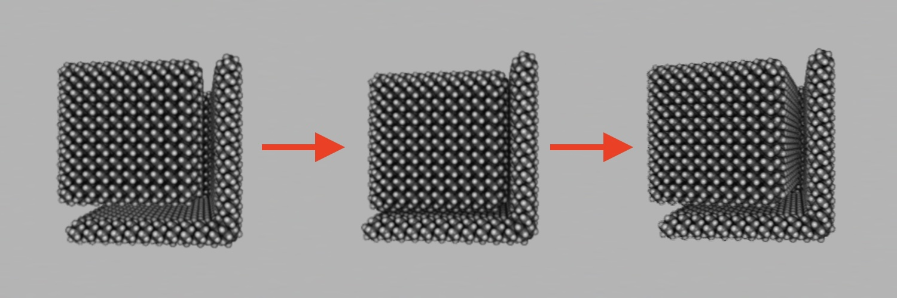
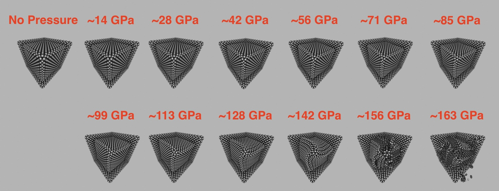

# Elastic Moduli

This is part of an effort to validate the accuracy of MM4. In theory, bulk material properties like lattice constant and stiffness should be reproduced to within 1&ndash;10% error. The measurement process faces a combinatorial explosion - multiple properties, multiple materials, multiple force magnitudes, multiple system sizes.

It would be insightful to walk through the process of solving the combinatorial explosion. At first glance, the compute cost seems to not be the bottleneck. Rather, the complexity of the source code. Experiments need to be organized into data structures, with functions and initializers for different conditions. There must be ways to quickly prototype a production simulation, discover and fix errors, summarize the results, etc.

So far, there were some initial experiments. These revealed potential problems that may appear in production, and should be anticipated during code design. There was also a work breakdown structure. The project was estimated to take about a week. Since it was not the author's top priority, the project was put on hold.

## Scene Setup

Experiment: A traditional energy minimizer does not minimize vdW potential energy to sufficient accuracy, only internal deformations. One typically starts a simulation with energy-minimized rigid bodies, then uses MD or RBD to simulate evolution over time.

Simulation: jig + specimen, 16,296 atoms, 9.6 ps evolution

Energy Minimization: 0.6 seconds latency

Molecular Dynamics: 2 fs timestep, 7.7 seconds latency


Rigid Body Dynamics: 40 fs timestep, 0.9 seconds latency



RBD seems sufficient for setting up the scene, and minimizing the vdW potential energy. One can erase the rigid body's velocity periodically to remove energy from the system. It is necessary to let the potential energy escape via kinetic energy. This differs from traditional energy minimization, which analyzes potential energy in isolation.

## Diamond Anvil

To prototype the measurement of bulk modulus, a virtual diamond anvil was created. The jig was anchored in place by setting the mass of every quaternary (`MM4AtomCode.quaternary`) atom to zero. An external force (`MM4ForceField.externalForces`) was exerted on a fraction of the specimen atoms. These atoms were located on the surface of outward-pointing faces. The normal force from the jig pointed opposite to the external forces, making the net force zero.

Pressure was calculated as the total force on any face, divided by the area of a 10x10 array of lattice cells. This significantly underestimates the pressure at extremely high pressures. The diamond can be compressed a factor of ~1.3x in each linear dimension, changing the area by ~1.7x.

The system was simulated for 120 frames. Each frame, the pressure per surface atom was incremented by 100 pN. The forcefield was minimized for a maximum of 30 iterations. The cap on iterations was set because minimizations started taking several seconds each with extreme pressures. The atom positions from each frame were recycled for the subsequent one, accelerating the convergence of the subsequent minimization.



The setup was retried with 20 femtoseconds of temporal evolution each frame. The results were not satisfactory. To get the same results, 100 femtoseconds of temporal evolution was required. However, the overall latency of MD simulation was half that of minimization. This could be explained by the GPU to CPU latency bottleneck. 100 femtoseconds is 50 timesteps, close to the 30 iterations for minimization. However, the system is small enough that each singlepoint executes in under 1 millisecond.

```
Energy Minimization:
frame=0, force=0 pN/atom, pressure=0 MPa
frame=10, force=1000 pN/atom, pressure=14226 MPa
frame=20, force=2000 pN/atom, pressure=28451 MPa
frame=30, force=3000 pN/atom, pressure=42677 MPa
frame=40, force=4000 pN/atom, pressure=56903 MPa
frame=50, force=5000 pN/atom, pressure=71128 MPa
frame=60, force=6000 pN/atom, pressure=85354 MPa
frame=70, force=7000 pN/atom, pressure=99580 MPa
frame=80, force=8000 pN/atom, pressure=113805 MPa
frame=90, force=9000 pN/atom, pressure=128031 MPa
frame=100, force=10000 pN/atom, pressure=142257 MPa
frame=110, force=11000 pN/atom, pressure=156482 MPa
Failed after 115 frames.
atoms: 16653
frames: 348
setup time: 22055.9 ms

Molecular Dynamics:
frame=0, force=0 pN/atom, pressure=0 MPa
frame=10, force=1000 pN/atom, pressure=14226 MPa
frame=20, force=2000 pN/atom, pressure=28451 MPa
frame=30, force=3000 pN/atom, pressure=42677 MPa
frame=40, force=4000 pN/atom, pressure=56903 MPa
frame=50, force=5000 pN/atom, pressure=71128 MPa
frame=60, force=6000 pN/atom, pressure=85354 MPa
frame=70, force=7000 pN/atom, pressure=99580 MPa
frame=80, force=8000 pN/atom, pressure=113805 MPa
frame=90, force=9000 pN/atom, pressure=128031 MPa
frame=100, force=10000 pN/atom, pressure=142257 MPa
frame=110, force=11000 pN/atom, pressure=156482 MPa
Failed after 113 frames.
atoms: 16653
frames: 342
setup time: 11276.4 ms
```

From this experiment, it appears that we should impose forces on the edges of 
the specimen. They should counteract the torsion caused by the three different
(100) planes being slightly off-center. Correction forces may also increase the
uniformity of the applied force.

> Insight: The system has a finite amount of atoms, so it doesn't always behave
> like a bulk/continuum material. However, we can add corrections to the
> modeling conditions to better represent bulk force/pressure. Push the system
> to the extremes of deformation and mitigate the artifacts that appear.

## Work Breakdown Structure

List:
 - Designing geometry and data structures
   - Setups for 4 different properties, each in 2 different regimes
     - Young's modulus
     - Poisson's ratio
     - Bulk modulus
     - Shear modulus
   - (100) reconstruction of every crystolecule
   - Organization into Swift code that is easy to extend and modify
     - Each unique physical object has its own type
     - Methods to select the atoms that receive forces and anchors
 - Testing simulations and correcting for artifacts
   - Finding low-latency alternatives to accurate simulation techniques
   - Walking through the execution of an entire production run
     - Walking through just one material property
     - Walking through just one material
   - Energy minimization, or lack thereof in certain execution paths
 - Running long production simulations and recording the data
   - Adapting simulations of diamond to 3 additional materials
   - Determining which datasets will have graphs generated
   - Fusing compressive and tensile experiments into the same dataset
   - Visual documentation of various simulation snapshots
 - Analyzing the results
   - Gathering material properties from the literature
   - Self-consistency of the system of elastic moduli
   - Running additional simulation trials at different system sizes
   - Whether/how MM4 parameters for elemental silicon should be adjusted
