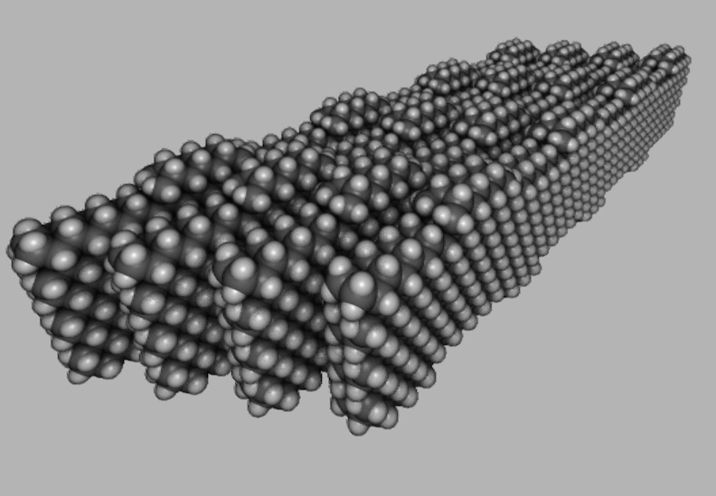
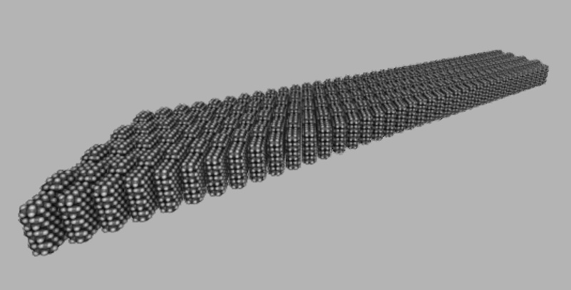
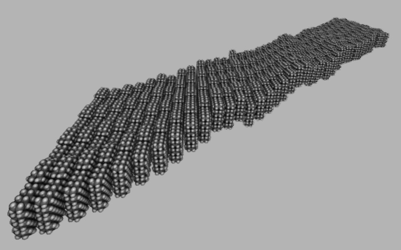
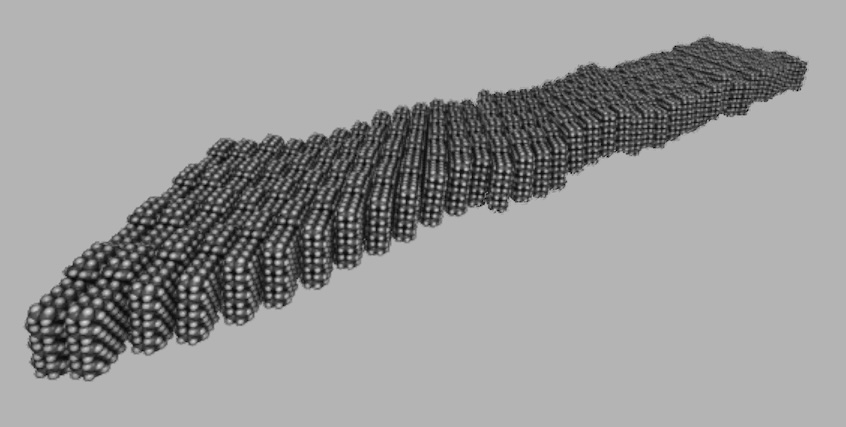
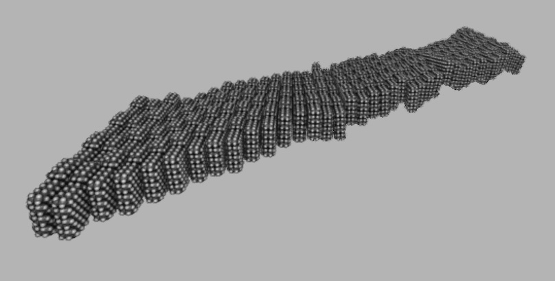
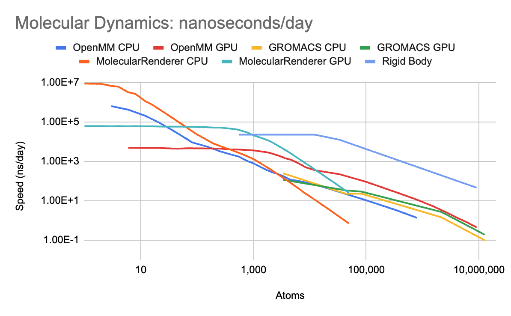
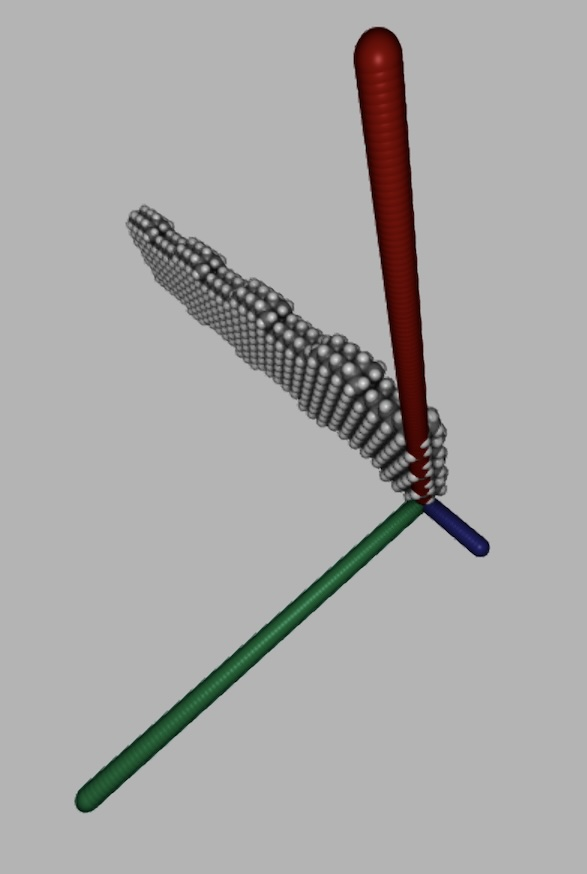
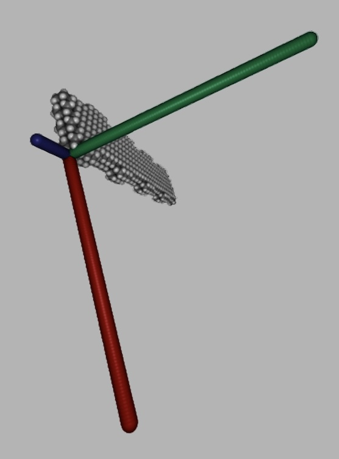
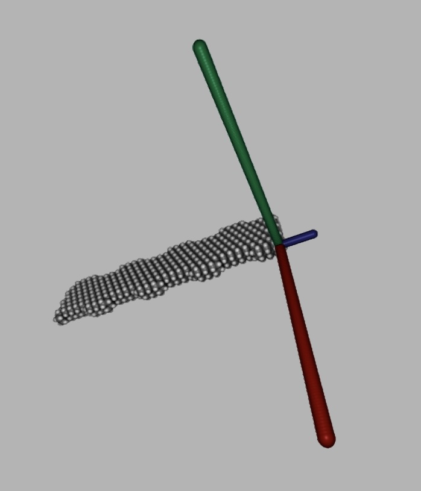

# Non-Contact Force Mechanism

The idea of using vdW forces instead of elastic springs was originally discovered by CBN Nano Technologies. Prior to the patent's publication, I independently discovered the idea. My intent was to use "vdW springs" to drive the clocking mechanism of a mechanical computer. I created some schematics for this a few days before the patent surfaced. It is not the same as CBN's idea to make the logic gates themselves run on vdW forces. Doing that creates monstrous, bulky logic with 1000x lower volumetric packing density than rod logic.

A crystolecule, loosely inspired by NCF mechanisms, was designed with the hardware description language. It was shaped into a shell structure and embedded into an HDL unit test. The linear form powered a ~3-day-long experiment with rigid body dynamics. That experiment is recorded on this README. The hypothesized outcome was a faster alternative to MD that could produce low-latency, robust animation. In addition, the project would produce content for `MM4ForceField` unit tests.

## Experiment

By relying on non-contact forces, one can entirely eliminate deformations from the system. This allows the equations of motion to be integrated with rigid body dynamics, which assumes the objects are infinitely stiff and non-deformable. Ideally, one would energy-minimize beforehand in a non-rigid model, then freeze the atom positions into a rigid body. I'm not yet sure whether one can have hybrid MM-RBM (molecular mechanics + rigid body mechanics) in the same way as existing QM-MM (quantum mechanics + molecular mechanics) simulations. There are some ideas for modeling deformations in an RBM context with or without bond stretching/bending forces.

Generally, multiscale simulations happen with the same simulation framework. Hybrid QM-MM simulations with xTB use a molecular mechanical model embedded into xTB. This is the GFN-FF force field. The speed difference between two levels of theory is a factor of 10&ndash;100. If RBM were to be combined with MM, it would likely happen within the same simulation framework: MM4. The speed difference between different levels of theory would also be ~10x.

Objectives:
- Investigate the maximum possible timestep with rigid body dynamics.
- Recycle this experiment into a set of low-latency MM4 unit tests, covering
  all of the basic functionality of an MVP.
- Experiment with workflows that divide work into smaller chunks. Anticipate
  and avoid burnout by alternating between 2 unrelated objectives.
- Continue sharpening the ability to accomplish multiple tasks in the same
  project, reducing the total time to solve all of them.

Experiment:
- Set up the NCFMechanism data structure. ✅
- Adjust TopologyMinimizer to have the same ergonomic rigid body API as
  MM4ForceField. ✅
- Compare the instantaneous forces in TopologyMinimizer with a 1-part vs.
  2-part system. ✅
- Compute the net force and torque on each rigid body in the 2-part system. ✅
- Set up a Verlet integrator. ✅
 - Visualize an MD and rigid body dynamics trajectory side-by-side, both
   with the same timestep. ✅
- Study where the system breaks down in the limit of large time steps. ✅
  - This particular system breaks down at ~100 fs time step. ✅
  - Study viability of a variable time step that automatically detects
    force explosions and recursively retries with a smaller timestep. ✅

After correcting for a mistake in timestep reporting, I got further
evidence the stable timestep is ~80-160 fs. This is exciting news! The
stable timestep varies in an interesting way with the energy threshold/tolerance:

| energy drift tolerance | stable time step | outcome |
| -----------------: | :---: | :--------------------- |
| molecular dynamics |  2 fs | setup time: 29456.6 ms |
|        0.1 yJ/atom | &lt;0.6 fs | failure           |
|        0.3 yJ/atom | &lt;0.6 fs | failure           |
|        1   yJ/atom | &lt;0.6 fs | failure           |
|        3   yJ/atom | 40 fs | setup time: 12618.0 ms |
|       10   yJ/atom | 80 fs | setup time: 14042.8 ms |
|       30   yJ/atom | 80 fs | setup time: 17919.8 ms |
|      100   yJ/atom | 80 fs | setup time: 15441.0 ms |
|      300   yJ/atom | 80 fs | setup time: 15690.9 ms |
    
Also, note that the rigid body dynamics implementation is significantly
underoptimized. It performs better with larger systems that can amortize
the overhead of GPU communication. Plus, we still need to vectorize and
parallelize the CPU-side code.
  - The most important insight is not the absolute speedup measured, but
    the increase in timestep measured.
  - Second, the issues that arise with conservation of momentum with rigid
    body mechanics. We need to look into why we needed to store the
    momenta separately from the atom velocities. In addition, why the code
    reported the momenta as drifting with rigid body dynamics, but not
    with molecular dynamics. It is obviously very messy code, and we'll
    need to start over from scratch to make more progress.
  - Third, base64 encoding can do a lot of useful things. I might even
    look into base64-encoding the forces from TopologyMinimizer and pasting
    into the MM4 test suite. That can recycle the existing function
    'encodeAtoms' with no changes, or the API can be revised to something
    with more general function names (e.g. encodeFloat4).

Running the benchmark again with 10x more atoms (6k -> 60k) and 1/10 the time (112 ps -> 11.2 ps):

| energy drift tolerance | stable time step | outcome |
| -----------------: | :---: | :--------------------- |
| molecular dynamics |  2 fs | setup time: 23429.2 ms |
|        0.1 yJ/atom | &lt;0.6 fs | failure           |
|        0.3 yJ/atom | &lt;0.6 fs | failure           |
|        1   yJ/atom | 40 fs | setup time: 11015.8 ms |
|        3   yJ/atom | 80 fs | setup time:  8334.3 ms |
|       10   yJ/atom | 80 fs | setup time:  7983.7 ms |
|       30   yJ/atom | 80 fs | setup time:  8541.5 ms |
|      100   yJ/atom | 80 fs | setup time:  9099.6 ms |
|      300   yJ/atom | 80 fs | setup time: 10707.5 ms |

## Images

The smaller the energy tolerance, the closer the result looked to molecular dynamics. However, setting the tolerance too low can harm performance. It can result in more failed attempts to increase the time step. It can even cause the simulation to fail, becoming trapped with a timestep asymptotically diving toward zero.

The tabulated data (above; previous section) showed that larger systems can survive with tighter energy tolerance. This may be a unique feature of the provided system. Its geometry and dynamics changed as the number of stacked crystolecules increased. The total simulation time also shortened, decreasing the opportunity for crystolecules to randomly escape the vdW well and leave machine phase.

Start:

Molecular Dynamics:

Rigid Body Dynamics (1 yJ/atom tolerance):

Rigid Body Dynamics (3 yJ/atom tolerance):

Rigid Body Dynamics (10 yJ/atom tolerance):

Rigid Body Dynamics (30 yJ/atom tolerance):

Rigid Body Dynamics (100 yJ/atom tolerance):

Rigid Body Dynamics (300 yJ/atom tolerance):

## Conclusion

Here is a rough estimate of the upper bound to simulation speed. Note that it is a liberal estimate, the only number that can be proven with certainty. The real-world performance will likely be at least 2-3x slower. However, the real-world performance of the old MM4 implementation was also 2-3x slower than OpenMM water box. The gap may exist because of MM4 torsions and cross-terms. These forces are omitted from the new MM4 (technically included in the codebase, but rarely used).

> Note: The label "MolecularRenderer" in this graph has no relation to the ray tracer. I use OpenMM for all simulation. This graph was originally part of a research project to design a simulator from scratch, and establish proofs about maximum simulation speed. I didn't know what to name it. So I called it the same name as the repository for presenting the animations. Hence, the beginning of the project name "Molecular Renderer". https://github.com/philipturner/noble-gas-md-simulation

Technical details of the liberal upper bound:
- Rigid body dynamics uses 1 nm radius for diamond, padding the overhead of search from 700 atoms to effectively 1000 atoms. It does not account for the use of the more expensive Buckingham potential. Theoretically, the MM4RigidBody component of MM4 could be separated out and used with a custom GPU kernel to calculate forces.
- Rigid body dynamics assumes an 80 fs timestep, compared to 4 fs for molecular dynamics. It also assumes a performance ceiling equalling that of OpenMM with neighbor lists (1120 ns/day @ 4 fs/step).

## Addendum: Diagonalizing the Moment of Inertia

To go all-in on rigid body dynamics, I am rewriting the internal representation of `MM4RigidBody`. One beautiful part about this IR is how atoms are stored. They are shifted into a local coordinate frame where `[0, 0, 0]` is the center of mass. They are also rotated so the cardinal axes align with the principal moments of inertia.

It took several hours, but I accomplished a stable method of eigendecomposing the matrix. I used the direct analytical solution to cubic polynomials, which involved some debugging of complex numbers (GPT-4 used the iterative method that 99% of people use). The second part was solving some systems of linear equations. GPT-4 was using Gaussian elimination, but there was some hidden bug I could not solve. Instead, I went with direct matrix inversion.

Being ill-conditioned, matrix inversion occasionally produced NANs. But never for more than 1 vector in the eigenbasis. I could recover the lost eigenvector with a cross product of the other two. I generated about 100 random rotation axes and sampled each at ~2-degree resolution through the process of rotating. Not a single one produced 2 NAN eigenvectors simultaneously. Despite GPT-4's warnings against the matrix inversion method, I conclude it is stable.

Here are a few instances where the inertia tensor is diagonalized. No information about the rigid body's orientation is known a priori; all of it is solved analytically. The source of truth is the array of atom positions.

